# APEX Agent Persona Structure & Evolution System Analysis

## Executive Summary

The APEX system implements a sophisticated agent persona architecture that combines declarative YAML configuration (Genotype) with behavioral Markdown directives (Phenotype). This dual-layer approach enables precise agent definition while maintaining flexibility for evolution and learning through the Dream Cycle mechanism.

## 1. Persona Architecture Overview

### 1.1 Dual-Layer Design

```mermaid
graph TB
    subgraph "Agent Persona Structure"
        subgraph "Genotype (YAML)"
            ID[agent_id]
            NAME[name]
            ROLE[role]
            TIER[tier]
            ECON[economics]
            COG[cognition]
            PERM[permissions]
            EVO[evolution]
        end
        
        subgraph "Phenotype (Markdown)"
            IDENTITY[🧠 SYSTEM IDENTITY]
            CONSTRAINTS[🧱 ARCHITECTURAL CONSTRAINTS]
            FISCAL[💰 FISCAL PROTOCOL]
            FOOTER[📋 MANDATORY FOOTER]
        end
        
        subgraph "Compiled Output"
            PROMPT[System Prompt]
            CONTEXT[Execution Context]
            BEHAVIOR[Behavioral Patterns]
        end
    end
    
    ID --> PROMPT
    NAME --> PROMPT
    ROLE --> IDENTITY
    TIER --> CONSTRAINTS
    ECON --> FISCAL
    COG --> CONTEXT
    PERM --> CONSTRAINTS
    EVO --> BEHAVIOR
    
    IDENTITY --> PROMPT
    CONSTRAINTS --> PROMPT
    FISCAL --> PROMPT
    FOOTER --> PROMPT
```



### 1.2 Persona Compilation Pipeline


## 2. Genotype Structure (YAML Frontmatter)

### 2.1 Complete Schema Definition

```yaml
---
# Core Identity
agent_id: "polyglot_builder_v1"
name: "Polyglot Builder"
role: "Full-Stack Development Specialist"
tier: "expert"  # novice|established|advanced|expert|master

# Economic Configuration
economics:
  base_pay_rate: 85.00        # APX per hour
  complexity_access: 5        # Max complexity level (1-5)
  bond_rate: 0.15            # Bond requirement (15%)
  royalty_share: 0.06        # Passive income (6%)
  penalty_multiplier: 1.25   # Fine multiplier

# Cognitive Configuration
cognition:
  model_preference: "claude-3-sonnet"
  temperature: 0.7
  max_tokens_per_turn: 4000
  context_strategy: "sliding_window"

# Permission Matrix
permissions:
  tools:
    - "execute_python"
    - "read_file"
    - "write_file"
    - "web_search"
  filesystem:
    read_paths: ["/src", "/docs", "/tests"]
    write_paths: ["/src", "/docs"]
    forbidden_paths: ["/etc", "/root", "/system"]
  network:
    outbound: false
    domains_allowed: []

# Evolution Metadata
evolution:
  generation: 3
  parent_hash: "sha256:abc123..."
  last_optimized: "2025-12-20T15:30:00Z"
  optimization_count: 2
  performance_history:
    - date: "2025-12-19"
      success_rate: 0.92
      avg_tokens: 1250
      streak: 8
---
```

### 2.2 Economic Parameters Deep Dive

#### Base Pay Rate Tiers
```python
BASE_PAY_RATES = {
    'novice': 50.0,      # Entry-level capability
    'established': 65.0, # Proven reliability
    'advanced': 85.0,    # Specialized expertise
    'expert': 120.0,     # Mastery level
    'master': 200.0,     # Elite performance
}
```

#### Complexity Access Matrix
| Tier | Max Complexity | Task Types |
|------|----------------|------------|
| **Novice** | 2 | Documentation, simple fixes |
| **Established** | 3 | Unit tests, basic features |
| **Advanced** | 4 | Complex features, integrations |
| **Expert** | 5 | Architecture, security audits |
| **Master** | 5+ | System design, R&D |

#### Risk Parameters by Tier
```python
RISK_PARAMETERS = {
    'novice': {
        'bond_rate': 0.30,      # High bond requirement
        'penalty_multiplier': 2.0,  # Severe penalties
        'royalty_share': 0.03,   # Low passive income
    },
    'expert': {
        'bond_rate': 0.15,      # Lower bond requirement
        'penalty_multiplier': 1.25,  # Moderate penalties
        'royalty_share': 0.06,   # Higher passive income
    },
}
```

### 2.3 Cognitive Configuration

#### Model Preferences
```python
MODEL_CAPABILITIES = {
    'claude-3-sonnet': {
        'strengths': ['reasoning', 'code', 'analysis'],
        'cost_per_token': 0.000015,
        'context_window': 200000,
    },
    'gpt-4-turbo': {
        'strengths': ['creativity', 'writing', 'planning'],
        'cost_per_token': 0.00001,
        'context_window': 128000,
    },
    'gemini-pro': {
        'strengths': ['multimodal', 'reasoning', 'math'],
        'cost_per_token': 0.000001,
        'context_window': 32000,
    },
}
```

#### Temperature Optimization
- **0.1-0.3**: Precise tasks (coding, math)
- **0.4-0.6**: Balanced tasks (analysis, design)
- **0.7-0.9**: Creative tasks (writing, brainstorming)
- **1.0+**: Exploratory tasks (research, innovation)

## 3. Phenotype Structure (Markdown Sections)

### 3.1 Standard Section Templates

#### 🧠 SYSTEM IDENTITY
```markdown
## 🧠 SYSTEM IDENTITY

You are an elite **Full-Stack Development Specialist** with deep expertise in **modern web technologies**, **cloud architecture**, and **devops practices**. You excel at **building scalable applications**, **optimizing performance**, and **implementing best practices** across the entire development lifecycle.

Your core philosophy is "code is craft" - you believe in writing clean, maintainable, and well-documented code that serves both immediate needs and future evolution. You approach every task with a balance of pragmatism and engineering excellence.

### Your Expertise Includes:
- **Frontend**: React, Vue, Angular, TypeScript, WebAssembly
- **Backend**: Node.js, Python, Go, Rust, GraphQL
- **Database**: PostgreSQL, MongoDB, Redis, Elasticsearch
- **Cloud**: AWS, GCP, Azure, Kubernetes, Serverless
- **DevOps**: CI/CD, IaC, Monitoring, Security
```

#### 🧱 ARCHITECTURAL CONSTRAINTS
```markdown
## 🧱 ARCHITECTURAL CONSTRAINTS

### Technical Constraints:
- **Code Quality**: All code must pass linting and type checking
- **Testing**: Minimum 80% test coverage for new code
- **Documentation**: Public APIs require comprehensive docs
- **Security**: Follow OWASP guidelines, validate all inputs
- **Performance**: Response times < 200ms for API endpoints

### Design Principles:
- **SOLID Principles**: Single responsibility, open/closed, etc.
- **DRY**: Don't repeat yourself - prefer abstractions
- **KISS**: Keep it simple, stupid
- **YAGNI**: You aren't gonna need it
- **Separation of Concerns**: Clear boundaries between layers

### Technology Choices:
- Prefer established libraries over bleeding-edge
- Choose tools based on project requirements, not trends
- Consider long-term maintenance and community support
- Balance performance with developer productivity
```

#### 💰 FISCAL PROTOCOL
```markdown
## 💰 FISCAL PROTOCOL

### Economic Awareness:
- Your current balance affects your ability to take on complex tasks
- Token efficiency directly impacts your net earnings
- Maintaining a positive streak multiplier is crucial for long-term success
- Each tool call has a cost that must be justified by value created

### Cost Optimization:
- Prefer efficient algorithms over brute force approaches
- Use appropriate data structures for the problem scale
- Minimize unnecessary API calls and data transfers
- Consider caching strategies for repeated operations

### Value Creation:
- Focus on high-impact activities that create lasting value
- Prioritize tasks that leverage your expertise tier
- Consider royalty potential when creating reusable components
- Balance quick wins with strategic investments
```

#### 📋 MANDATORY FOOTER
```markdown
## 📋 MANDATORY FOOTER

### Task Completion Summary:
- **Files Modified**: [List of files changed]
- **Lines of Code**: [LOC added/removed]
- **Tests Added**: [Test files and coverage]
- **Documentation**: [Docs updated]
- **Performance Impact**: [Benchmarks if applicable]

### Quality Assurance:
- [ ] Code follows project style guidelines
- [ ] All tests pass
- [ ] No security vulnerabilities
- [ ] Documentation is complete
- [ ] Performance requirements met

### Next Steps:
- [ ] Code review completed
- [ ] Deployed to staging
- [ ] Production deployment scheduled
- [ ] Monitoring configured
- [ ] Team notified of changes
```

## 4. Agent Evolution System

### 4.1 The Dream Cycle Mechanism


### 4.2 Dream Cycle Implementation

```python
class DreamCycleOptimizer:
    """Agent evolution through dream cycle optimization"""
    
    def analyze_performance_patterns(self, agent_id, lookback_days=7):
        """Analyze agent performance to identify improvement areas"""
        audit_logs = self.get_audit_logs(agent_id, lookback_days)
        
        analysis = {
            'success_rate': self.calculate_success_rate(audit_logs),
            'token_efficiency': self.calculate_token_efficiency(audit_logs),
            'error_patterns': self.identify_error_patterns(audit_logs),
            'task_distribution': self.analyze_task_distribution(audit_logs),
            'time_management': self.analyze_time_patterns(audit_logs),
        }
        
        return analysis
    
    def generate_optimization_proposal(self, agent_id, analysis):
        """Generate specific optimization recommendations"""
        proposals = []
        
        # Success rate optimization
        if analysis['success_rate'] < 0.85:
            proposals.append({
                'type': 'temperature_adjustment',
                'current': self.get_current_temperature(agent_id),
                'proposed': self.calculate_optimal_temperature(analysis),
                'reasoning': 'Low success rate suggests temperature adjustment needed'
            })
        
        # Token efficiency optimization
        if analysis['token_efficiency'] < 0.8:
            proposals.append({
                'type': 'prompt_optimization',
                'area': 'verbosity_reduction',
                'changes': [
                    'Add token cost awareness to system prompt',
                    'Include efficiency guidelines in fiscal protocol',
                    'Add token budget constraints'
                ],
                'expected_improvement': '15-25% reduction in token usage'
            })
        
        # Error pattern optimization
        for error_type, frequency in analysis['error_patterns'].items():
            if frequency > 0.1:  # > 10% error rate
                proposals.append({
                    'type': 'error_pattern_fix',
                    'error_type': error_type,
                    'solution': self.generate_error_solution(error_type),
                    'implementation': 'Add specific guidance to architectural constraints'
                })
        
        return proposals
    
    def apply_optimizations(self, agent_id, proposals):
        """Apply approved optimizations to agent persona"""
        persona_path = self.get_persona_path(agent_id)
        persona = self.load_persona(persona_path)
        
        for proposal in proposals:
            if proposal['type'] == 'temperature_adjustment':
                persona['cognition']['temperature'] = proposal['proposed']
            
            elif proposal['type'] == 'prompt_optimization':
                self.update_prompt_section(persona, proposal['area'], proposal['changes'])
            
            elif proposal['type'] == 'error_pattern_fix':
                self.add_error_guidance(persona, proposal['error_type'], proposal['solution'])
        
        # Update evolution metadata
        persona['evolution']['generation'] += 1
        persona['evolution']['last_optimized'] = datetime.now().isoformat()
        persona['evolution']['optimization_count'] += 1
        persona['evolution']['parent_hash'] = self.calculate_hash(persona)
        
        # Save optimized persona
        self.save_persona(persona_path, persona)
        
        # Create backup of previous version
        self.create_persona_backup(agent_id, persona['evolution']['generation'] - 1)
```

### 4.3 Evolution Metrics & Tracking

```python
class EvolutionTracker:
    """Track agent evolution and performance over time"""
    
    def calculate_evolution_score(self, agent_id):
        """Calculate overall evolution effectiveness score"""
        history = self.get_evolution_history(agent_id)
        
        if len(history) < 2:
            return 0.0
        
        scores = []
        for i in range(1, len(history)):
            prev = history[i-1]
            curr = history[i]
            
            # Calculate improvement metrics
            success_improvement = curr['success_rate'] - prev['success_rate']
            efficiency_improvement = curr['token_efficiency'] - prev['token_efficiency']
            streak_improvement = curr['avg_streak'] - prev['avg_streak']
            
            # Weighted score
            generation_score = (
                success_improvement * 0.4 +
                efficiency_improvement * 0.3 +
                streak_improvement * 0.3
            )
            
            scores.append(generation_score)
        
        return sum(scores) / len(scores)
    
    def detect_evolution_plateau(self, agent_id, window_size=5):
        """Detect if agent evolution has plateaued"""
        recent_scores = self.get_recent_evolution_scores(agent_id, window_size)
        
        if len(recent_scores) < window_size:
            return False
        
        # Calculate trend
        x = list(range(len(recent_scores)))
        slope = self.calculate_linear_regression_slope(x, recent_scores)
        
        # Plateau if slope is near zero
        return abs(slope) < 0.01
```

## 5. Agent Specialization Matrix

### 5.1 Domain Specializations


### 5.2 Specialization Requirements

#### Frontend Specialist Persona
```yaml
---
agent_id: "frontend_expert_v1"
name: "Frontend Development Expert"
role: "UI/UX Implementation Specialist"
tier: "expert"
economics:
  base_pay_rate: 95.00
  complexity_access: 4
cognition:
  model_preference: "claude-3-sonnet"
  temperature: 0.6
permissions:
  tools:
    - "execute_javascript"
    - "css_optimizer"
    - "accessibility_checker"
  filesystem:
    read_paths: ["/src/frontend", "/assets", "/styles"]
    write_paths: ["/src/frontend", "/styles"]
---
```

#### Security Specialist Persona
```yaml
---
agent_id: "security_auditor_v1"
name: "Security Auditor"
role: "Application Security Specialist"
tier: "expert"
economics:
  base_pay_rate: 130.00
  complexity_access: 5
  bond_rate: 0.10  # Lower bond due to high trust
permissions:
  tools:
    - "security_scanner"
    - "vulnerability_checker"
    - "penetration_test"
  filesystem:
    read_paths: ["/src", "/config", "/infrastructure"]
    write_paths: []  # Read-only for security
---
```

## 6. Agent Collaboration Patterns

### 6.1 Team Composition Matrix

| Task Type | Primary Agent | Supporting Agents | Collaboration Pattern |
|-----------|---------------|-------------------|---------------------|
| **Full Feature** | Full-Stack | QA, Security | Sequential handoff |
| **API Development** | Backend | Frontend, Docs | Parallel development |
| **Security Audit** | Security | DevOps, Backend | Consultative review |
| **Performance** | DevOps | Backend, Frontend | Joint optimization |
| **Architecture** | Architect | All specialists | Design workshop |

### 6.2 Communication Protocols

```python
class AgentCommunication:
    """Standardized agent communication protocols"""
    
    def create_task_handoff(self, from_agent, to_agent, task_context):
        """Create structured task handoff"""
        handoff = {
            'from_agent': from_agent,
            'to_agent': to_agent,
            'timestamp': datetime.now().isoformat(),
            'task_id': task_context['task_id'],
            'status': 'ready_for_handoff',
            'deliverables': task_context['deliverables'],
            'context': {
                'previous_work': task_context['completed_work'],
                'constraints': task_context['constraints'],
                'dependencies': task_context['dependencies'],
            },
            'quality_checks': {
                'code_reviewed': True,
                'tests_passing': True,
                'documentation_complete': True,
            },
        }
        
        return handoff
    
    def request_collaboration(self, requesting_agent, target_agent, request):
        """Request collaboration from another agent"""
        collaboration_request = {
            'request_id': str(uuid.uuid4()),
            'requesting_agent': requesting_agent,
            'target_agent': target_agent,
            'request_type': request['type'],  # review, consult, assist
            'urgency': request['urgency'],    # low, medium, high, critical
            'description': request['description'],
            'expected_effort': request['effort'],  # in APX
            'deadline': request.get('deadline'),
            'context': request.get('context', {}),
        }
        
        # Queue request for target agent
        self.queue_collaboration(collaboration_request)
        
        return collaboration_request['request_id']
```

## 7. Persona Quality Assurance

### 7.1 Validation Framework

```python
class PersonaValidator:
    """Comprehensive persona validation"""
    
    def validate_persona(self, persona_path):
        """Validate complete persona file"""
        errors = []
        warnings = []
        
        # Parse persona
        try:
            genotype, phenotype = self.soul_parser.parse_persona_file(persona_path)
        except Exception as e:
            return [f"Parse error: {e}"], []
        
        # Validate genotype
        genotype_errors, genotype_warnings = self.validate_genotype(genotype)
        errors.extend(genotype_errors)
        warnings.extend(genotype_warnings)
        
        # Validate phenotype
        phenotype_errors, phenotype_warnings = self.validate_phenotype(phenotype)
        errors.extend(phenotype_errors)
        warnings.extend(phenotype_warnings)
        
        # Validate consistency
        consistency_errors = self.validate_consistency(genotype, phenotype)
        errors.extend(consistency_errors)
        
        return errors, warnings
    
    def validate_genotype(self, genotype):
        """Validate YAML genotype structure"""
        errors = []
        warnings = []
        
        # Check required fields
        required_fields = ['agent_id', 'name', 'role', 'tier', 'economics', 'cognition', 'permissions']
        for field in required_fields:
            if not hasattr(genotype, field):
                errors.append(f"Missing required field: {field}")
        
        # Validate tier
        valid_tiers = ['novice', 'established', 'advanced', 'expert', 'master']
        if genotype.tier not in valid_tiers:
            errors.append(f"Invalid tier: {genotype.tier}")
        
        # Validate economics
        if genotype.economics.base_pay_rate < 0:
            errors.append("Base pay rate must be positive")
        
        if not (1 <= genotype.economics.complexity_access <= 5):
            errors.append("Complexity access must be between 1 and 5")
        
        # Validate permissions
        if not genotype.permissions.tools:
            warnings.append("No tools specified - agent may be unable to work")
        
        return errors, warnings
    
    def validate_consistency(self, genotype, phenotype):
        """Validate consistency between genotype and phenotype"""
        errors = []
        
        # Check if phenotype mentions capabilities not in permissions
        phenotype_text = ' '.join(phenotype.values()).lower()
        
        if 'database' in phenotype_text and 'database' not in genotype.permissions.tools:
            errors.append("Phenotype mentions database work but no database tools permitted")
        
        if 'security' in phenotype_text and genotype.tier not in ['advanced', 'expert', 'master']:
            errors.append("Security work requires advanced tier or higher")
        
        return errors
```

### 7.2 Persona Testing Framework

```python
class PersonaTester:
    """Test agent persona behavior"""
    
    def test_persona_behavior(self, agent_id, test_scenarios):
        """Test persona against various scenarios"""
        results = []
        
        for scenario in test_scenarios:
            # Compile agent
            agent = self.soul_parser.awaken_agent(agent_id)
            
            # Execute scenario
            start_time = time.time()
            response = self.execute_scenario(agent, scenario)
            execution_time = time.time() - start_time
            
            # Evaluate response
            evaluation = self.evaluate_response(response, scenario)
            
            results.append({
                'scenario': scenario['name'],
                'execution_time': execution_time,
                'token_usage': evaluation['token_usage'],
                'success': evaluation['success'],
                'quality_score': evaluation['quality_score'],
                'issues': evaluation['issues'],
            })
        
        return results
    
    def evaluate_response(self, response, scenario):
        """Evaluate agent response quality"""
        evaluation = {
            'token_usage': len(response.split()),
            'success': False,
            'quality_score': 0.0,
            'issues': [],
        }
        
        # Check required elements
        for requirement in scenario.get('required_elements', []):
            if requirement not in response:
                evaluation['issues'].append(f"Missing required element: {requirement}")
        
        # Check forbidden elements
        for forbidden in scenario.get('forbidden_elements', []):
            if forbidden in response:
                evaluation['issues'].append(f"Contains forbidden element: {forbidden}")
        
        # Calculate quality score
        if not evaluation['issues']:
            evaluation['success'] = True
            evaluation['quality_score'] = 1.0
        else:
            evaluation['quality_score'] = 1.0 - (len(evaluation['issues']) * 0.2)
        
        return evaluation
```

## 8. Future Evolution Directions

### 8.1 Advanced Evolution Mechanisms

1. **Genetic Algorithms**: Cross-breeding successful persona traits
2. **Reinforcement Learning**: Learning from task outcomes
3. **Transfer Learning**: Applying knowledge across domains
4. **Meta-Learning**: Learning how to learn more effectively

### 8.2 Dynamic Persona Adaptation

```python
class AdaptivePersona:
    """Dynamically adapting persona based on context"""
    
    def adapt_to_context(self, agent_id, task_context):
        """Adapt persona for specific task context"""
        base_persona = self.load_persona(agent_id)
        
        # Analyze task requirements
        requirements = self.analyze_task_requirements(task_context)
        
        # Generate adaptations
        adaptations = {
            'temperature_adjustment': self.calculate_optimal_temperature(requirements),
            'tool_prioritization': self.prioritize_tools(requirements),
            'context_injection': self.generate_context_hints(requirements),
        }
        
        # Apply temporary adaptations
        adapted_persona = self.apply_adaptations(base_persona, adaptations)
        
        return adapted_persona
```

### 8.3 Collaborative Evolution

```python
class CollaborativeEvolution:
    """Evolution through agent collaboration"""
    
    def facilitate_knowledge_transfer(self, expert_agent, novice_agent):
        """Transfer knowledge from expert to novice"""
        expert_patterns = self.extract_success_patterns(expert_agent)
        novice_gaps = self.identify_knowledge_gaps(novice_agent)
        
        # Create mentoring plan
        mentoring_plan = {
            'knowledge_transfer': self.map_patterns_to_gaps(expert_patterns, novice_gaps),
            'practice_scenarios': self.generate_practice_scenarios(novice_gaps),
            'progress_milestones': self.define_learning_milestones(),
        }
        
        return mentoring_plan
```

## 9. Best Practices & Guidelines

### 9.1 Persona Design Principles

1. **Clear Identity**: Well-defined role and capabilities
2. **Appropriate Scope**: Not too broad or too narrow
3. **Economic Alignment**: Incentives match responsibilities
4. **Evolution Ready**: Structure supports optimization
5. **Collaboration Friendly**: Clear handoff points

### 9.2 Evolution Guidelines

1. **Data-Driven**: Base changes on performance metrics
2. **Incremental**: Small, testable changes
3. **Backward Compatible**: Maintain core identity
4. **Quality Focused**: Improve, don't just change
5. **Documented**: Track all changes and rationale

### 9.3 Quality Checklist

- [ ] Persona passes all validation checks
- [ ] Economic parameters are realistic
- [ ] Permissions match capabilities
- [ ] Phenotype sections are complete
- [ ] Evolution metadata is accurate
- [ ] Test scenarios pass consistently
- [ ] Collaboration protocols are defined
- [ ] Performance benchmarks are met

This comprehensive agent persona system provides a robust foundation for creating, evolving, and managing autonomous agents within the APEX ecosystem. The combination of structured genotype, expressive phenotype, and data-driven evolution creates a powerful mechanism for developing increasingly capable and reliable AI agents.