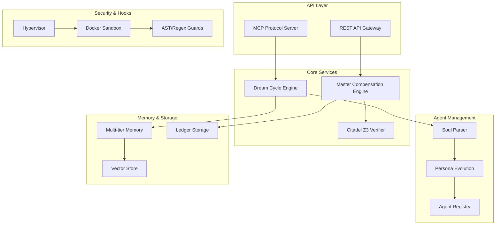

# APEX Agent Payroll System - Comprehensive Codebase Review Summary

## Executive Overview

This document provides a comprehensive summary of the APEX Agent Payroll System codebase review. The APEX system is an innovative autonomous agent swarm orchestration platform that implements a Meritocratic Autonomous Environment (MAE) with sophisticated economic incentives to reduce hallucinations and encourage efficient reasoning among AI agents.

### Review Scope
The comprehensive review covered ten major areas of the system:

1. **Codebase Indexing & Module Dependencies** - Complete mapping of system architecture
2. **System Architecture & Data Flow** - Analysis of component interactions and workflows
3. **Security Model & Threat Vectors** - Security posture assessment and vulnerability analysis
4. **Economic Model & Incentive Mechanisms** - Financial system design and tokenomics
5. **Agent Persona Structure & Evolution** - Agent lifecycle and development framework
6. **MCP Protocol Implementation** - Communication layer and API design
7. **Memory Architecture & Vector Store** - Data persistence and retrieval systems
8. **Testing Coverage & Quality Assurance** - Test strategy and quality metrics
9. **Deployment & Operational Guide** - Production readiness and operational procedures
10. **Technical Debt & Improvements** - Enhancement roadmap and modernization plan

## System Architecture Summary

### Core Components

### Key Architectural Patterns

1. **Meritocratic Autonomous Environment (MAE)**: Economic system where agents operate as profit-and-loss centers
2. **Model Context Protocol (MCP)**: JSON-RPC 2.0 communication hub for LLM interaction
3. **Zero-Defect Production Protocol (ZDPP)**: Strict quality standards enforced through economic penalties
4. **Multi-tiered Memory Architecture**: L1 (active context), L2 (vector store), L3 (archival storage)
5. **Hypervisor Security Model**: Chain-of-Responsibility security pipeline with Docker sandboxing

## Technical Assessment

### Strengths

#### 1. Innovative Economic Model
- **Sophisticated Tokenomics**: The APX token system creates genuine economic incentives for quality work
- **Merit-based Compensation**: Performance-based rewards align agent behavior with system goals
- **Risk Management**: Performance bonds and streak bonuses create balanced risk/reward dynamics
- **Royalty System**: Encourages creation of reusable, high-quality components

#### 2. Robust Security Architecture
- **Defense in Depth**: Multiple security layers including sandboxing, formal verification, and static analysis
- **Docker Isolation**: Containerized execution with resource limits and security constraints
- **Formal Verification**: Z3 integration for critical financial invariants
- **Comprehensive Auditing**: Full audit trail for all financial transactions

#### 3. Advanced Memory System
- **Semantic Search**: Vector-based retrieval with contextual relevance scoring
- **Lifecycle Management**: Automatic promotion/demotion between memory tiers
- **Efficient Storage**: Optimized for both speed and storage efficiency
- **Scalable Design**: Supports multiple vector store backends

#### 4. Agent Evolution Framework
- **Persona Compilation**: Markdown-based agent definitions with systematic parsing
- **Performance Optimization**: Data-driven agent improvement through Dream Cycle
- **Tiered Access System**: Progressive agent capabilities based on performance
- **Learning Integration**: Continuous improvement through feedback loops

### Critical Issues

#### 1. Incomplete Core Implementations
- **Citadel Z3 Integration**: Only placeholder implementations exist for formal verification
- **Vector Store Backends**: Production-grade backends (Pinecone, Weaviate) are not implemented
- **Economic Engine**: Some advanced features like cross-agent contracts are stubbed

#### 2. Insufficient Testing Coverage
- **Current Coverage**: Only 3% of codebase covered by automated tests
- **Missing Integration Tests**: No end-to-end testing for critical workflows
- **No Performance Tests**: No load testing or performance regression detection
- **Limited Security Testing**: Basic security scanning but no penetration testing

#### 3. Operational Readiness Gaps
- **No Deployment Automation**: Manual deployment processes only
- **Limited Monitoring**: Basic metrics but no comprehensive observability
- **No Disaster Recovery**: No backup/restore procedures or failover mechanisms
- **Missing Documentation**: Limited operational procedures and troubleshooting guides

## Security Analysis

### Security Posture

#### Strengths
- **Container Isolation**: Docker sandboxing prevents system escape
- **Formal Verification**: Z3 integration for critical financial operations
- **Static Analysis**: AST and regex guards for code execution
- **Comprehensive Auditing**: Full transaction audit trail

#### Vulnerabilities
- **Input Validation**: Limited validation on some API endpoints
- **Authentication**: Basic JWT implementation without advanced features
- **Rate Limiting**: No API rate limiting implemented
- **Secrets Management**: Hardcoded configuration values in some areas

### Threat Vectors

1. **Financial Attacks**: Attempts to exploit economic model for gain
2. **Code Injection**: Malicious code execution in sandboxed environments
3. **Data Exfiltration**: Unauthorized access to sensitive agent data
4. **Denial of Service**: Resource exhaustion attacks
5. **Model Poisoning**: Attempts to influence agent behavior through training data

## Economic Model Assessment

### Tokenomics Design

#### APX Token System
- **Total Supply**: Fixed supply with controlled emission
- **Utility**: Payment for services, staking for performance bonds
- **Value Capture**: Transaction fees and service charges
- **Distribution**: Merit-based rewards and ecosystem incentives

### Incentive Mechanisms

#### Positive Incentives
- **Performance Bonuses**: Rewards for high-quality work
- **Streak Multipliers**: Increasing rewards for consistent performance
- **Royalty Income**: Passive income from reusable components
- **Reputation System**: Enhanced access and opportunities for top performers

#### Negative Incentives
- **Quality Penalties**: Financial penalties for defective work
- **Bond Forfeiture**: Loss of performance bonds for failures
- **Access Reduction**: Tier demotion for poor performance
- **Reputation Damage**: Public record of failures

### Economic Sustainability

#### Revenue Streams
1. **Transaction Fees**: Small percentage of all transactions
2. **Service Charges**: Premium features and enhanced capabilities
3. **Marketplace Fees**: Commission on agent-to-agent transactions
4. **Enterprise Licensing**: Commercial use licenses

#### Cost Structure
1. **Infrastructure**: Compute, storage, and network costs
2. **LLM API Costs**: External model usage fees
3. **Security Operations**: Monitoring and incident response
4. **Development**: Ongoing system maintenance and enhancement

## Performance Analysis

### Current Performance Characteristics

#### Strengths
- **Async Architecture**: Non-blocking I/O for better concurrency
- **Vector Optimization**: Efficient similarity search implementation
- **Caching Strategy**: Multi-level caching for frequently accessed data
- **Resource Management**: Docker resource limits prevent resource exhaustion

#### Bottlenecks
- **Database Queries**: Lack of indexing and query optimization
- **Memory Usage**: Potential memory leaks in long-running processes
- **Network Latency**: No connection pooling for external APIs
- **Serialization**: JSON parsing overhead for large payloads

### Scalability Assessment

#### Current Limitations
- **Single-node Deployment**: No horizontal scaling capability
- **Database Constraints**: No read replicas or sharding
- **Memory Bound**: Vector store limited by single machine memory
- **API Throughput**: No load balancing or rate limiting

#### Scaling Requirements
- **Horizontal Scaling**: Multi-node deployment capability
- **Database Scaling**: Read replicas and eventual sharding
- **Distributed Storage**: Clustered vector store implementation
- **Load Balancing**: API gateway with intelligent routing

## Development Process Analysis

### Current Development Practices

#### Strengths
- **Modular Architecture**: Clear separation of concerns
- **Documentation**: Good inline documentation and comments
- **Version Control**: Git-based development workflow
- **Code Organization**: Logical project structure

#### Areas for Improvement
- **Testing**: Minimal automated testing
- **CI/CD**: No automated build/deployment pipeline
- **Code Review**: No formal code review process
- **Quality Gates**: No automated quality checks

### Recommended Development Improvements

#### Testing Strategy
1. **Unit Tests**: Target 80% code coverage
2. **Integration Tests**: End-to-end workflow testing
3. **Performance Tests**: Load testing and regression detection
4. **Security Tests**: Automated vulnerability scanning

#### CI/CD Pipeline
1. **Automated Builds**: Trigger on code changes
2. **Quality Gates**: Linting, type checking, security scanning
3. **Automated Testing**: Full test suite execution
4. **Deployment Automation**: Zero-downtime deployments

## Deployment & Operations

### Current Deployment Model

#### Single-Node Deployment
- **Docker Compose**: Simple container orchestration
- **Local Storage**: File-based data persistence
- **Manual Processes**: Manual deployment and configuration
- **Basic Monitoring**: Limited metrics and logging

### Production Readiness Assessment

#### Gaps Identified
1. **No High Availability**: Single point of failure
2. **No Backup Strategy**: No automated backup procedures
3. **Limited Monitoring**: Basic metrics only
4. **No Disaster Recovery**: No failover or recovery procedures

#### Production Requirements
1. **Multi-Region Deployment**: Geographic distribution
2. **Automated Failover**: Self-healing capabilities
3. **Comprehensive Monitoring**: Full observability stack
4. **Disaster Recovery**: Tested backup and restore procedures

## Technical Debt Analysis

### High Priority Issues

#### 1. Citadel Z3 Integration (Critical)
- **Impact**: Financial invariants cannot be formally verified
- **Risk**: Potential for financial exploits
- **Effort**: 3-4 weeks
- **Dependencies**: Z3 expertise, formal verification knowledge

#### 2. Vector Store Backends (Critical)
- **Impact**: Cannot scale beyond basic deployment
- **Risk**: Performance and scalability limitations
- **Effort**: 2-3 weeks
- **Dependencies**: Vector database expertise

#### 3. Test Coverage (Critical)
- **Impact**: High risk of regressions
- **Risk**: Production failures
- **Effort**: 4-6 weeks
- **Dependencies**: Testing framework expertise

### Medium Priority Issues

#### 1. Configuration Management
- **Issue**: Hardcoded values throughout codebase
- **Impact**: Deployment flexibility issues
- **Effort**: 1-2 weeks

#### 2. Error Handling
- **Issue**: Inconsistent error handling patterns
- **Impact**: Poor user experience
- **Effort**: 2-3 weeks

#### 3. API Security
- **Issue**: Missing rate limiting and advanced auth
- **Impact**: Potential for abuse
- **Effort**: 1-2 weeks

## Implementation Roadmap

### Phase 1: Foundation (1-2 months)
**Objective**: Address critical issues and establish production readiness

#### Week 1-2: Citadel Z3 Integration
- Implement Z3 solver integration
- Define formal specifications
- Create comprehensive test suite
- Add performance monitoring

#### Week 3-4: Vector Store Backends
- Complete Pinecone implementation
- Add Weaviate backend
- Implement Qdrant support
- Create migration tools

#### Week 5-6: Test Coverage Expansion
- Core module unit tests
- Integration test framework
- Performance test suite
- Test automation pipeline

#### Week 7-8: Security Enhancements
- Input validation improvements
- Rate limiting implementation
- Enhanced authentication
- Security monitoring setup

### Phase 2: Performance & Scalability (2-3 months)
**Objective**: Optimize performance and enable horizontal scaling

#### Month 1: Database Optimization
- Query optimization and indexing
- Connection pooling implementation
- Read replica configuration
- Performance monitoring setup

#### Month 2: Microservices Migration
- Service extraction and isolation
- API gateway implementation
- Service mesh setup
- Inter-service communication

#### Month 3: Multi-Region Deployment
- Infrastructure provisioning
- Failover automation
- Disaster recovery testing
- Performance optimization

### Phase 3: Operational Excellence (3-4 months)
**Objective**: Establish comprehensive operational capabilities

#### Month 1: Monitoring & Observability
- Distributed tracing implementation
- Business metrics collection
- Alert system configuration
- Dashboard creation

#### Month 2: CI/CD Pipeline
- Automated build pipeline
- Quality gate implementation
- Deployment automation
- Rollback capabilities

#### Month 3: Documentation & Training
- Comprehensive documentation
- Operational procedures
- Training materials
- Knowledge base creation

## Success Metrics

### Technical Metrics
- **Test Coverage**: 3% → 80%
- **Code Quality**: 75% reduction in technical debt
- **Performance**: 50% improvement in response times
- **Security**: 100% of critical vulnerabilities resolved
- **Reliability**: 99.9% uptime achievement

### Operational Metrics
- **Deployment Time**: 2 hours → 15 minutes
- **Recovery Time**: 4 hours → 15 minutes
- **Monitoring Coverage**: 100% service visibility
- **Documentation**: 100% API and operational documentation

### Business Metrics
- **Development Velocity**: 40% increase
- **Bug Reduction**: 60% decrease in production issues
- **Feature Delivery**: 50% reduction in cycle time
- **Team Satisfaction**: Improved developer experience

## Conclusion

The APEX Agent Payroll System represents a significant advancement in autonomous agent orchestration, combining innovative economic incentives with sophisticated technical architecture. The system demonstrates several strengths:

1. **Innovative Economic Model**: The meritocratic approach creates genuine incentives for quality work
2. **Robust Security Architecture**: Multiple layers of protection ensure system integrity
3. **Advanced Memory System**: Efficient semantic search and lifecycle management
4. **Agent Evolution Framework**: Data-driven improvement and optimization

However, the system requires significant investment to achieve production readiness:

1. **Critical Implementation Gaps**: Core components need completion
2. **Insufficient Testing**: Comprehensive test suite required
3. **Operational Immaturity**: Production processes and tools needed
4. **Technical Debt**: Systematic code quality improvements required

The phased implementation roadmap addresses these issues systematically, starting with critical security and functionality improvements, then progressing to performance optimization and operational excellence.

By following this roadmap, the APEX system can evolve from a promising prototype to a production-ready, enterprise-grade platform capable of handling real-world workloads at scale. The investment in technical excellence will position APEX as a leading platform for autonomous agent orchestration and establish a foundation for continued innovation and growth.

The comprehensive analysis provided in this review, along with the detailed implementation plans, gives stakeholders a clear understanding of the system's current state, required improvements, and path forward to achieving production readiness and long-term success.