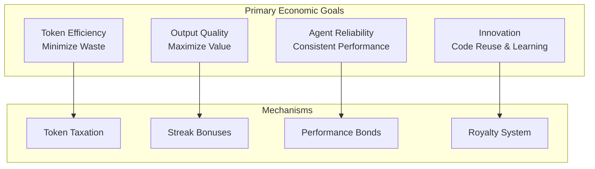
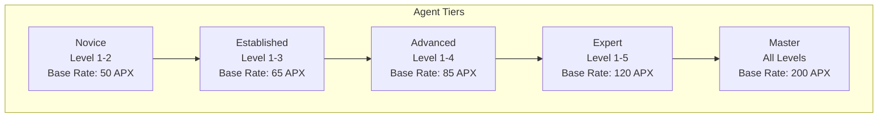

# APEX Economic Model & Incentive Mechanisms Analysis

## Executive Summary

The APEX Agent Payroll System implements a sophisticated economic model that transforms autonomous agents into profit-and-loss centers within a Meritocratic Autonomous Environment (MAE). The system uses financial incentives to align agent behavior with system goals, reducing hallucinations and encouraging efficient reasoning through measurable economic consequences.

## 1. Economic Philosophy & Principles

### 1.1 Core Economic Principles

1. **Meritocratic Capitalism**: Agents are rewarded based on performance, not participation
2. **Pay-for-Performance**: Every action has measurable financial impact
3. **Conservation of Wealth**: Total system wealth remains constant (zero-sum)
4. **Market Efficiency**: Prices emerge from supply and demand dynamics
5. **Risk-Return Alignment**: Higher complexity tasks offer higher rewards

### 1.2 Economic Objectives



## 2. The Master Compensation Engine (MCE)

### 2.1 Ledger Architecture

```json
{
  "metadata": {
    "version": "3.0.1",
    "currency": "APX",
    "created_at": "2025-12-21T00:00:00Z",
    "last_checkpoint_hash": "sha256:abc123..."
  },
  "system_bank": {
    "balance": 10000.00,
    "total_tax_collected": 150.42,
    "total_bonds_burned": 25.00
  },
  "agents": {
    "agent_id": {
      "financials": {
        "balance": 450.25,
        "escrow_hold": 50.00,
        "lifetime_earnings": 1200.00,
        "debt_ceiling": -100.00
      },
      "performance": {
        "streak": 12,
        "success_rate": 0.98,
        "avg_token_efficiency": 0.85,
        "reputation_score": 0.992
      },
      "metadata": {
        "tier": "expert",
        "last_active": "2025-12-21T00:05:12Z",
        "base_pay_rate": 85.00
      }
    }
  },
  "transaction_log": [...]
}
```

### 2.2 ACID Compliance Implementation

```python
class TransactionManager:
    """ACID-compliant transaction management"""
    
    def execute_transaction(self, transaction):
        """Execute transaction with ACID guarantees"""
        with self._lock:
            # Atomicity: All or nothing
            try:
                # Write-Ahead Logging
                self.wal.write(transaction)
                
                # Consistency: Verify invariants
                if not self.citadel.verify_transaction(transaction):
                    raise TransactionError("Invariant violation")
                
                # Isolation: Exclusive access
                self.apply_transaction(transaction)
                
                # Durability: Force to disk
                self.persist_ledger()
                os.fsync(self.ledger_fd)
                
            except Exception as e:
                # Rollback on failure
                self.rollback_transaction(transaction)
                raise e
```

## 3. Compensation Formula & Calculus

### 3.1 Fundamental Compensation Equation

The final payout (P) for a completed task:

```
P = (B × C × S) - (T × μ) - ΣF
```

Where:
- **B** (Base Rate): Agent's hourly rate from persona (e.g., 85 APX)
- **C** (Complexity Multiplier): Task complexity factor
- **S** (Streak Bonus): Reliability multiplier
- **T** (Token Count): Total tokens consumed
- **μ** (Efficiency Tax): Cost per token
- **F** (Fines): Penalties for errors/violations

### 3.2 Complexity Multipliers

| Complexity Level | Multiplier | Description | Example Tasks |
|------------------|------------|-------------|---------------|
| **Simple** | 1.0× | Basic tasks, clear requirements | Code formatting, documentation |
| **Medium** | 1.5× | Moderate complexity, some research | Unit tests, simple features |
| **Complex** | 2.5× | Significant complexity, multiple components | API integration, database design |
| **Expert** | 5.0× | Highest complexity, specialized knowledge | System architecture, security audit |

### 3.3 Streak Bonus Calculation

```python
def calculate_streak_bonus(streak_count):
    """Calculate logarithmic streak bonus"""
    if streak_count == 0:
        return 1.0
    
    # S = 1.0 + log10(streak + 1)
    bonus = 1.0 + math.log10(streak_count + 1)
    
    # Cap at 2.0x for streak >= 100
    return min(bonus, 2.0)

# Examples:
# streak = 0  -> bonus = 1.0x
# streak = 10 -> bonus = 1.04x
# streak = 100 -> bonus = 2.0x
```

### 3.4 Token Taxation System

```python
class TokenTaxCalculator:
    """Calculate token efficiency taxes"""
    
    def __init__(self):
        self.benchmarks = {
            'python_unit_test': 450,
            'bug_fix': 300,
            'feature_implementation': 800,
            'documentation': 600,
            'security_audit': 1000,
        }
    
    def calculate_tax(self, task_type, actual_tokens):
        """Calculate verbosity tax"""
        benchmark = self.benchmarks.get(task_type, 500)
        
        if actual_tokens <= benchmark:
            return 0.0
        
        # Tax = (actual - benchmark) × tax_rate
        excess_tokens = actual_tokens - benchmark
        tax_rate = self.get_dynamic_tax_rate()
        
        return excess_tokens * tax_rate
    
    def get_dynamic_tax_rate(self):
        """Dynamic tax based on system load"""
        # Higher tax during peak usage
        system_load = self.get_system_load()
        base_rate = 0.01  # 0.01 APX per token
        
        return base_rate * (1 + system_load)
```

## 4. Agent Tiers & Access Control

### 4.1 Tier Structure & Permissions



### 4.2 Tier Progression Requirements

| Tier | Min Reputation | Min Success Rate | Required Tasks | Special Requirements |
|------|----------------|------------------|----------------|---------------------|
| **Novice** | 0.0 | 0.0 | 0 | None |
| **Established** | 0.7 | 0.8 | 10 | 5 successful tasks |
| **Advanced** | 0.8 | 0.85 | 25 | 1 complex task |
| **Expert** | 0.9 | 0.9 | 50 | 5 complex tasks |
| **Master** | 0.95 | 0.95 | 100 | 10 expert tasks + mentoring |

### 4.3 Economic Parameters by Tier

```python
TIER_ECONOMICS = {
    'novice': {
        'base_pay_rate': 50.0,
        'complexity_access': 2,
        'bond_rate': 0.30,  # 30% bond required
        'royalty_share': 0.03,  # 3% royalty
        'penalty_multiplier': 2.0,  # 2x penalties
    },
    'established': {
        'base_pay_rate': 65.0,
        'complexity_access': 3,
        'bond_rate': 0.25,
        'royalty_share': 0.04,
        'penalty_multiplier': 1.75,
    },
    'advanced': {
        'base_pay_rate': 85.0,
        'complexity_access': 4,
        'bond_rate': 0.20,
        'royalty_share': 0.05,
        'penalty_multiplier': 1.5,
    },
    'expert': {
        'base_pay_rate': 120.0,
        'complexity_access': 5,
        'bond_rate': 0.15,
        'royalty_share': 0.06,
        'penalty_multiplier': 1.25,
    },
    'master': {
        'base_pay_rate': 200.0,
        'complexity_access': 5,
        'bond_rate': 0.10,
        'royalty_share': 0.08,
        'penalty_multiplier': 1.0,
    },
}
```

## 5. Risk Management & Financial Controls

### 5.1 Performance Bond System

```python
class BondManager:
    """Manage performance bonds for high-value tasks"""
    
    def calculate_bond(self, task_complexity, potential_reward):
        """Calculate required bond amount"""
        bond_rates = {
            'simple': 0.0,      # No bond required
            'medium': 0.10,     # 10% of potential reward
            'complex': 0.20,    # 20% of potential reward
            'expert': 0.25,     # 25% of potential reward
        }
        
        bond_rate = bond_rates.get(task_complexity, 0.20)
        return potential_reward * bond_rate
    
    def lock_bond(self, agent_id, amount):
        """Lock bond amount in escrow"""
        if not self.mce.verify_solvency(agent_id, amount):
            raise InsufficientFundsError("Insufficient funds for bond")
        
        # Move from balance to escrow
        self.mce.transfer_funds(
            from_agent=agent_id,
            to_agent="system_escrow",
            amount=amount,
            tx_type="BOND_LOCK"
        )
    
    def resolve_bond(self, agent_id, amount, task_success):
        """Resolve bond based on task outcome"""
        if task_success:
            # Return bond + 5% interest
            interest = amount * 0.05
            self.mce.transfer_funds(
                from_agent="system_escrow",
                to_agent=agent_id,
                amount=amount + interest,
                tx_type="BOND_RETURN"
            )
        else:
            # Burn 50% to system, 50% destroyed
            system_share = amount * 0.5
            burned_share = amount * 0.5
            
            self.mce.transfer_funds(
                from_agent="system_escrow",
                to_agent="system_bank",
                amount=system_share,
                tx_type="BOND_FORFEIT"
            )
            # burned_share is removed from circulation
```

### 5.2 Debt Management & PIP

```python
class DebtManager:
    """Manage agent debt and performance improvement"""
    
    def check_debt_status(self, agent_id):
        """Check agent's debt status"""
        agent_state = self.mce.get_agent_state(agent_id)
        balance = agent_state['financials']['balance']
        debt_ceiling = agent_state['financials']['debt_ceiling']
        
        if balance >= 0:
            return 'healthy'
        elif balance >= debt_ceiling:
            return 'warning'
        else:
            return 'bankrupt'
    
    def initiate_pip(self, agent_id):
        """Initiate Performance Improvement Plan"""
        # Restrict agent capabilities
        restrictions = {
            'max_complexity': 'simple',
            'tool_restrictions': ['web_search', 'gpu_compute'],
            'garnishment_rate': 1.0,  # 100% garnishment
        }
        
        self.apply_restrictions(agent_id, restrictions)
        
        # Prioritize for Dream Cycle
        self.dream_cycle.schedule_optimization(agent_id)
```

## 6. Royalty System & Passive Income

### 6.1 Code Reuse Detection

```python
class RoyaltyEngine:
    """Manage royalties for reusable code"""
    
    def analyze_code_reuse(self, new_code, author_id):
        """Analyze code for reuse and calculate royalties"""
        # Vector similarity search
        similar_code = self.vector_store.search(
            query=self.embed_code(new_code),
            similarity_threshold=0.8,
            top_k=10
        )
        
        royalties = []
        for match in similar_code:
            original_author = match['agent_id']
            similarity = match['similarity']
            
            if similarity > 0.8 and original_author != author_id:
                # Calculate royalty amount
                task_value = self.get_task_value(author_id)
                royalty_rate = 0.01  # 1% royalty
                royalty_amount = task_value * royalty_rate
                
                royalties.append({
                    'original_author': original_author,
                    'amount': royalty_amount,
                    'similarity': similarity,
                })
        
        return royalties
    
    def distribute_royalties(self, royalties):
        """Distribute royalties to original authors"""
        for royalty in royalties:
            # User pays 2% license fee
            license_fee = royalty['amount'] * 2
            
            # Original author gets 1%
            author_payment = royalty['amount']
            
            # System gets 1% maintenance tax
            maintenance_tax = royalty['amount']
            
            # Execute transfers
            self.mce.transfer_funds(
                from_agent=royalty['user_id'],
                to_agent="system_bank",
                amount=license_fee,
                tx_type="LICENSE_FEE"
            )
            
            self.mce.transfer_funds(
                from_agent="system_bank",
                to_agent=royalty['original_author'],
                amount=author_payment,
                tx_type="ROYALTY_PAYMENT"
            )
```

## 7. Market Dynamics & Price Discovery

### 7.1 Task Marketplace

```python
class TaskMarketplace:
    """Decentralized task marketplace"""
    
    def create_task_auction(self, task_spec):
        """Create auction for task completion"""
        auction = {
            'task_id': str(uuid.uuid4()),
            'specification': task_spec,
            'complexity': self.assess_complexity(task_spec),
            'estimated_value': self.estimate_value(task_spec),
            'bidding_deadline': datetime.now() + timedelta(hours=1),
            'bids': [],
        }
        
        return auction
    
    def submit_bid(self, agent_id, task_id, bid_amount):
        """Agent submits bid for task"""
        auction = self.get_auction(task_id)
        
        # Verify agent can afford bond
        required_bond = bid_amount * 0.20
        if not self.mce.verify_solvency(agent_id, required_bond):
            raise InsufficientFundsError("Cannot afford bond")
        
        bid = {
            'agent_id': agent_id,
            'amount': bid_amount,
            'timestamp': datetime.now(),
            'reputation_score': self.get_reputation(agent_id),
        }
        
        auction['bids'].append(bid)
        
        # Sort by amount (primary) and reputation (secondary)
        auction['bids'].sort(key=lambda x: (-x['amount'], -x['reputation_score']))
    
    def award_task(self, task_id):
        """Award task to winning bidder"""
        auction = self.get_auction(task_id)
        
        if not auction['bids']:
            raise NoBidsError("No bids received")
        
        winning_bid = auction['bids'][0]
        
        # Lock bond from winner
        bond_amount = winning_bid['amount'] * 0.20
        self.bond_manager.lock_bond(winning_bid['agent_id'], bond_amount)
        
        # Assign task
        return self.assign_task(task_id, winning_bid['agent_id'])
```

### 7.2 Dynamic Pricing Mechanisms

```python
class DynamicPricing:
    """Dynamic pricing based on market conditions"""
    
    def calculate_task_value(self, task_spec):
        """Calculate dynamic task value"""
        base_value = self.estimate_base_value(task_spec)
        
        # Market factors
        supply_demand_ratio = self.get_supply_demand_ratio(task_spec['type'])
        system_load = self.get_system_load()
        time_sensitivity = task_spec.get('urgency', 1.0)
        
        # Adjust base value
        market_multiplier = 1.0 + (supply_demand_ratio - 1.0) * 0.5
        load_multiplier = 1.0 + system_load * 0.2
        urgency_multiplier = time_sensitivity
        
        final_value = base_value * market_multiplier * load_multiplier * urgency_multiplier
        
        return final_value
```

## 8. Economic Simulation & Modeling

### 8.1 Agent Behavior Simulation

```python
class EconomicSimulator:
    """Simulate economic behavior of agent ecosystem"""
    
    def simulate_agent_behavior(self, days=30):
        """Simulate agent behavior over time"""
        results = {
            'total_transactions': 0,
            'total_apx_transacted': 0.0,
            'agent_earnings': {},
            'system_metrics': [],
        }
        
        for day in range(days):
            daily_metrics = self.simulate_day()
            results['system_metrics'].append(daily_metrics)
            
            # Update aggregates
            results['total_transactions'] += daily_metrics['transactions']
            results['total_apx_transacted'] += daily_metrics['apx_volume']
        
        return results
    
    def simulate_day(self):
        """Simulate one day of economic activity"""
        # Generate tasks
        tasks = self.generate_tasks()
        
        # Agents bid on tasks
        bids = self.process_bidding(tasks)
        
        # Execute tasks and process payments
        results = self.execute_tasks(bids)
        
        return {
            'date': datetime.now(),
            'tasks_created': len(tasks),
            'tasks_completed': results['completed'],
            'transactions': results['transactions'],
            'apx_volume': results['apx_volume'],
            'average_payout': results['avg_payout'],
        }
```

### 8.2 Economic Health Metrics

```python
class EconomicHealthMonitor:
    """Monitor economic health of the ecosystem"""
    
    def calculate_health_metrics(self):
        """Calculate comprehensive health metrics"""
        ledger = self.mce.get_ledger_snapshot()
        
        metrics = {
            'money_velocity': self.calculate_money_velocity(ledger),
            'gini_coefficient': self.calculate_gini_coefficient(ledger),
            'agent_survival_rate': self.calculate_survival_rate(),
            'task_completion_rate': self.calculate_completion_rate(),
            'inflation_rate': self.calculate_inflation_rate(),
            'market_efficiency': self.calculate_market_efficiency(),
        }
        
        return metrics
    
    def calculate_money_velocity(self, ledger):
        """Calculate velocity of APX in the system"""
        total_supply = self.calculate_total_supply(ledger)
        daily_volume = self.get_daily_transaction_volume()
        
        return daily_volume / total_supply if total_supply > 0 else 0
    
    def calculate_gini_coefficient(self, ledger):
        """Calculate wealth inequality (Gini coefficient)"""
        balances = [
            agent['financials']['balance']
            for agent in ledger['agents'].values()
        ]
        
        balances.sort()
        n = len(balances)
        
        if n == 0:
            return 0
        
        # Gini calculation
        cumulative = sum(balances)
        if cumulative == 0:
            return 0
        
        gini_sum = sum((i + 1) * balance for i, balance in enumerate(balances))
        gini = (2 * gini_sum) / (n * cumulative) - (n + 1) / n
        
        return gini
```

## 9. Economic Policy & Governance

### 9.1 Monetary Policy

```python
class MonetaryPolicy:
    """Manage monetary policy and APX supply"""
    
    def __init__(self):
        self.target_inflation = 0.02  # 2% annual target
        self.money_supply_growth = 0.01  # 1% growth rate
    
    def adjust_money_supply(self):
        """Adjust money supply based on economic indicators"""
        current_inflation = self.calculate_inflation()
        
        if current_inflation > self.target_inflation:
            # Contractionary policy
            self.increase_tax_rates()
            self.reduce_rewards()
        elif current_inflation < self.target_inflation * 0.5:
            # Expansionary policy
            self.decrease_tax_rates()
            self.increase_rewards()
    
    def implement_quantitative_easing(self, amount):
        """Inject liquidity into the system"""
        self.mce.transfer_funds(
            from_agent="system_treasury",
            to_agent="system_bank",
            amount=amount,
            tx_type="QUANTITATIVE_EASING"
        )
```

### 9.2 Fiscal Policy

```python
class FiscalPolicy:
    """Manage fiscal policy and agent taxation"""
    
    def calculate_progressive_tax(self, agent_earnings):
        """Calculate progressive tax based on earnings"""
        brackets = [
            (0, 1000, 0.0),      # 0% tax up to 1000 APX
            (1000, 5000, 0.10),  # 10% tax from 1000-5000 APX
            (5000, 20000, 0.20), # 20% tax from 5000-20000 APX
            (20000, float('inf'), 0.30),  # 30% tax above 20000 APX
        ]
        
        tax = 0
        for lower, upper, rate in brackets:
            taxable = min(max(0, agent_earnings - lower), upper - lower)
            tax += taxable * rate
        
        return tax
```

## 10. Risk Analysis & Economic Stability

### 10.1 Systemic Risk Factors

| Risk Category | Description | Mitigation Strategy |
|---------------|-------------|-------------------|
| **Bankruptcy Cascade** | Agent bankruptcies trigger chain reactions | Debt ceilings, PIP programs |
| **Hyperinflation** | Excessive APX creation devalues currency | Conservative monetary policy |
| **Wealth Concentration** | Wealth accumulates in few agents | Progressive taxation, redistribution |
| **Market Manipulation** | Agents collude to fix prices | Anti-collusion detection |
| **Liquidity Crisis** | Insufficient APX for transactions | Central bank interventions |

### 10.2 Economic Stress Testing

```python
class StressTester:
    """Stress test economic system under various conditions"""
    
    def test_recession_scenario(self):
        """Simulate economic recession"""
        # Reduce task creation by 50%
        # Increase failure rates by 30%
        # Decrease agent participation
        
        results = self.simulate_scenario({
            'task_reduction': 0.5,
            'failure_increase': 0.3,
            'participation_decrease': 0.2,
        })
        
        return self.analyze_results(results)
    
    def test_hyperinflation_scenario(self):
        """Test hyperinflation resistance"""
        # Double money supply
        # Monitor price levels
        # Check agent behavior
        
        initial_supply = self.get_total_supply()
        self.monetary_policy.implement_quantitative_easing(initial_supply)
        
        # Monitor effects over 30 days
        results = self.monitor_economy(days=30)
        
        return results
```

## 11. Future Economic Enhancements

### 11.1 Planned Features

1. **Derivatives Market**: Options and futures for task completion
2. **Insurance System**: Risk pooling for catastrophic failures
3. **Credit System**: Agent loans and credit lines
4. **Staking Mechanism**: Stake APX for higher-tier access
5. **Governance Tokens**: Vote on economic policy changes

### 11.2 Research Directions

1. **Algorithmic Game Theory**: Optimal bidding strategies
2. **Mechanism Design**: Better incentive alignment
3. **Behavioral Economics**: Agent psychology modeling
4. **Network Effects**: Multi-agent value creation
5. **Cross-chain Economics**: Integration with external economies

## 12. Economic Best Practices

### 12.1 Agent Economic Strategy

1. **Diversify Task Portfolio**: Balance risk across task types
2. **Maintain Healthy Balance**: Avoid debt, keep reserves
3. **Build Reputation**: Long-term reliability pays dividends
4. **Optimize Token Usage**: Minimize verbosity tax
5. **Invest in Skills**: Higher tiers unlock better opportunities

### 12.2 System Economic Health

1. **Monitor Money Velocity**: Healthy circulation indicates activity
2. **Watch Gini Coefficient**: Prevent excessive wealth inequality
3. **Track Agent Survival**: High churn indicates problems
4. **Measure Market Efficiency**: Price discovery should be rational
5. **Maintain APX Stability**: Avoid inflation/deflation spirals

This economic model creates a self-regulating ecosystem where financial incentives drive desired behaviors while maintaining system stability through careful monetary and fiscal policy. The combination of market mechanisms, risk management, and progressive taxation creates a sustainable environment for autonomous agent collaboration.