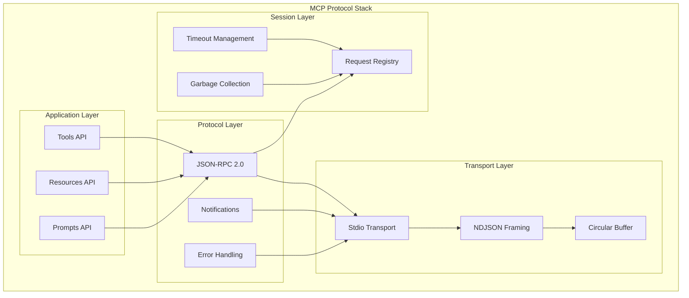

# APEX MCP Protocol Implementation Analysis

## Executive Summary

The APEX system implements a comprehensive Model Context Protocol (MCP) server that serves as the central nervous system for agent-LLM communication. The implementation follows JSON-RPC 2.0 standards with custom extensions for agent-specific operations, providing a robust foundation for asynchronous, high-performance interaction with various LLM providers.

## 1. MCP Architecture Overview

### 1.1 Protocol Stack



### 1.2 Core Components

```python
class MCPServer:
    """Main MCP server implementation"""
    
    def __init__(self):
        # Core components
        self.request_registry = ActiveRequestRegistry()
        self.transport = StdioTransport()
        self.dispatcher = RequestDispatcher()
        
        # Handler registries
        self._handlers = {}      # Method handlers
        self._resources = {}     # Resource providers
        self._tools = {}         # Tool implementations
        
        # System integrations
        self._mce = get_mce()    # Master Compensation Engine
        self._hooks = get_hook_manager()  # Hook system
```

## 2. Transport Layer Implementation

### 2.1 Stdio Transport with Circular Buffer

```python
class StdioTransport:
    """High-performance stdio transport with circular buffering"""
    
    def __init__(self, buffer_size=2*1024*1024):  # 2MB buffer
        self.buffer_size = buffer_size
        self.backpressure_threshold = buffer_size * 0.90  # 90%
        self.max_message_size = 512 * 1024  # 512KB max message
        
        # Async streams
        self.reader = None
        self.writer = None
        
        # Circular buffer
        self.buffer = CircularBuffer(buffer_size)
        self.buffer_lock = asyncio.Lock()
    
    async def initialize(self):
        """Initialize stdio streams"""
        loop = asyncio.get_event_loop()
        
        # Get stdin/stdout
        stdin = sys.stdin
        stdout = sys.stdout
        
        # Create async streams
        self.reader = asyncio.StreamReader()
        self.writer = asyncio.StreamWriter(
            stdout.transport, 
            stdout.protocol, 
            self.reader, 
            loop
        )
        
        # Start background reader
        asyncio.create_task(self._read_loop())
    
    async def _read_loop(self):
        """Background loop for reading stdin"""
        while True:
            try:
                data = await self.reader.read(self.buffer_size)
                if not data:
                    break
                
                async with self.buffer_lock:
                    # Check buffer capacity
                    if self.buffer.size() > self.backpressure_threshold:
                        # Send backpressure signal
                        await self._send_busy_signal()
                        await self._wait_for_drain()
                    
                    # Write to buffer
                    self.buffer.write(data)
                    
                    # Process complete messages
                    await self._process_messages()
                    
            except Exception as e:
                logger.error(f"Transport error: {e}")
                break
    
    async def _process_messages(self):
        """Process complete NDJSON messages from buffer"""
        while True:
            # Find newline delimiter
            newline_pos = self.buffer.find(b'\n')
            if newline_pos == -1:
                break
            
            # Extract message
            message_bytes = self.buffer.read(newline_pos + 1)
            
            # Skip newline
            self.buffer.read(1)
            
            # Check message size
            if len(message_bytes) > self.max_message_size:
                await self._send_error("Message too large")
                continue
            
            # Parse and dispatch
            try:
                message = json.loads(message_bytes.decode('utf-8'))
                await self.dispatcher.dispatch(message)
            except json.JSONDecodeError:
                await self._send_error("Invalid JSON")
```

### 2.2 Circular Buffer Implementation

```python
class CircularBuffer:
    """High-performance circular buffer for message framing"""
    
    def __init__(self, size):
        self.size = size
        self.buffer = bytearray(size)
        self.head = 0  # Write position
        self.tail = 0  # Read position
        self.count = 0  # Current data count
        self.lock = asyncio.Lock()
    
    def write(self, data):
        """Write data to buffer"""
        data_len = len(data)
        
        # Check if data fits
        if data_len > self.size - self.count:
            raise BufferError("Insufficient buffer space")
        
        # Write data (handle wrap-around)
        for byte in data:
            self.buffer[self.head] = byte
            self.head = (self.head + 1) % self.size
            self.count += 1
    
    def read(self, length):
        """Read data from buffer"""
        if length > self.count:
            raise BufferError("Insufficient data")
        
        result = bytearray()
        for _ in range(length):
            result.append(self.buffer[self.tail])
            self.tail = (self.tail + 1) % self.size
            self.count -= 1
        
        return bytes(result)
    
    def find(self, pattern):
        """Find pattern in buffer"""
        if self.count == 0:
            return -1
        
        # Linear search (could be optimized with KMP)
        for i in range(self.count):
            pos = (self.tail + i) % self.size
            if self.buffer[pos] == pattern[0]:
                match = True
                for j, byte in enumerate(pattern[1:], 1):
                    check_pos = (self.tail + i + j) % self.size
                    if self.buffer[check_pos] != byte:
                        match = False
                        break
                if match:
                    return i
        
        return -1
```

## 3. JSON-RPC 2.0 Implementation

### 3.1 Message Structure & Validation

```python
class JSONRPCMessage:
    """JSON-RPC 2.0 message with validation"""
    
    REQUIRED_FIELDS = {
        'request': ['jsonrpc', 'method', 'id'],
        'notification': ['jsonrpc', 'method'],
        'response': ['jsonrpc', 'result', 'id'],
        'error': ['jsonrpc', 'error', 'id'],
    }
    
    def __init__(self, data):
        self.raw_data = data
        self.jsonrpc = data.get('jsonrpc')
        self.method = data.get('method')
        self.params = data.get('params', {})
        self.id = data.get('id')
        self.result = data.get('result')
        self.error = data.get('error')
        
        # Validate structure
        self._validate()
    
    def _validate(self):
        """Validate message structure"""
        # Check JSON-RPC version
        if self.jsonrpc != '2.0':
            raise JSONRPCError(-32600, "Invalid JSON-RPC version")
        
        # Determine message type
        if self.method is not None:
            if self.id is not None:
                self.type = 'request'
                required = self.REQUIRED_FIELDS['request']
            else:
                self.type = 'notification'
                required = self.REQUIRED_FIELDS['notification']
        elif self.result is not None or self.error is not None:
            self.type = 'response' if self.result is not None else 'error'
            required = self.REQUIRED_FIELDS[self.type]
        else:
            raise JSONRPCError(-32600, "Invalid message structure")
        
        # Check required fields
        for field in required:
            if not hasattr(self, field) or getattr(self, field) is None:
                raise JSONRPCError(-32600, f"Missing required field: {field}")
```

### 3.2 Request Dispatcher

```python
class RequestDispatcher:
    """Dispatch JSON-RPC requests to appropriate handlers"""
    
    def __init__(self):
        self.handlers = {}
        self.middleware = []
    
    def register_handler(self, method, handler):
        """Register method handler"""
        self.handlers[method] = handler
    
    def add_middleware(self, middleware):
        """Add middleware for request processing"""
        self.middleware.append(middleware)
    
    async def dispatch(self, message):
        """Dispatch message to handler"""
        try:
            # Parse message
            msg = JSONRPCMessage(message)
            
            # Apply middleware
            for middleware in self.middleware:
                msg = await middleware.process(msg)
                if msg is None:
                    return  # Middleware handled response
            
            # Route to handler
            if msg.type == 'request':
                await self._handle_request(msg)
            elif msg.type == 'notification':
                await self._handle_notification(msg)
            else:
                logger.warning(f"Unexpected message type: {msg.type}")
                
        except JSONRPCError as e:
            await self._send_error(msg.id, e.code, e.message)
        except Exception as e:
            logger.error(f"Dispatch error: {e}")
            await self._send_error(msg.id, -32603, "Internal error")
    
    async def _handle_request(self, msg):
        """Handle JSON-RPC request"""
        # Register request
        await self.registry.register_request(msg.id, msg.method, msg.params)
        
        try:
            # Find handler
            handler = self.handlers.get(msg.method)
            if not handler:
                raise JSONRPCError(-32601, "Method not found")
            
            # Execute handler
            start_time = time.time()
            result = await handler(msg.params)
            execution_time = time.time() - start_time
            
            # Send response
            response = {
                'jsonrpc': '2.0',
                'result': result,
                'id': msg.id,
                'meta': {
                    'execution_time': execution_time,
                    'timestamp': datetime.now().isoformat(),
                }
            }
            
            await self.transport.send(response)
            
        finally:
            # Complete request
            await self.registry.complete_request(msg.id)
```

## 4. Request Registry & Lifecycle Management

### 4.1 Active Request Registry

```python
class ActiveRequestRegistry:
    """Track active requests with TTL and timeout handling"""
    
    def __init__(self, ttl_seconds=60, gc_interval=5):
        self.ttl_seconds = ttl_seconds
        self.gc_interval = gc_interval
        self.requests = {}
        self.lock = asyncio.Lock()
        
        # Start garbage collection
        asyncio.create_task(self._gc_loop())
    
    async def register_request(self, request_id, method, params):
        """Register new request"""
        async with self.lock:
            self.requests[request_id] = {
                'method': method,
                'params': params,
                'registered_at': datetime.now(timezone.utc),
                'status': 'active',
                'agent_id': params.get('agent_id'),
                'task_id': params.get('task_id'),
            }
    
    async def complete_request(self, request_id):
        """Mark request as completed"""
        async with self.lock:
            if request_id in self.requests:
                self.requests[request_id]['status'] = 'completed'
                self.requests[request_id]['completed_at'] = datetime.now(timezone.utc)
                
                # Calculate execution time
                execution_time = (
                    self.requests[request_id]['completed_at'] - 
                    self.requests[request_id]['registered_at']
                ).total_seconds()
                
                self.requests[request_id]['execution_time'] = execution_time
                
                # Remove from active registry after a delay
                asyncio.create_task(self._delayed_remove(request_id, 30))
    
    async def _gc_loop(self):
        """Garbage collection loop for expired requests"""
        while True:
            await asyncio.sleep(self.gc_interval)
            
            expired = await self.garbage_collect()
            
            if expired:
                # Apply performance penalties for timeouts
                for request_id in expired:
                    await self._handle_timeout(request_id)
    
    async def garbage_collect(self):
        """Remove expired requests"""
        expired = []
        now = datetime.now(timezone.utc)
        
        async with self.lock:
            for request_id, request in list(self.requests.items()):
                age = (now - request['registered_at']).total_seconds()
                
                if age > self.ttl_seconds:
                    expired.append(request_id)
                    del self.requests[request_id]
        
        return expired
    
    async def _handle_timeout(self, request_id):
        """Handle request timeout"""
        # Apply performance penalty to agent
        request = self.requests.get(request_id)
        if request and request['agent_id']:
            penalty = 5.0  # APX penalty
            self.mce.apply_performance_penalty(
                request['agent_id'], 
                penalty, 
                "Request timeout"
            )
        
        # Log timeout
        logger.warning(f"Request {request_id} timed out")
```

## 5. MCP API Implementation

### 5.1 Tools API

```python
class ToolsAPI:
    """MCP Tools API implementation"""
    
    def __init__(self, mcp_server):
        self.mcp_server = mcp_server
        self.tools = {}
        
        # Register standard handlers
        self.mcp_server.register_handler('tools/list', self.list_tools)
        self.mcp_server.register_handler('tools/call', self.call_tool)
    
    def register_tool(self, name, tool_impl):
        """Register a tool implementation"""
        self.tools[name] = tool_impl
    
    async def list_tools(self, params):
        """List available tools"""
        tools = []
        
        for name, tool in self.tools.items():
            tool_info = {
                'name': name,
                'description': tool.description,
                'inputSchema': tool.input_schema,
                'category': getattr(tool, 'category', 'general'),
                'cost': getattr(tool, 'cost', 0.0),
                'permissions': getattr(tool, 'permissions', []),
            }
            tools.append(tool_info)
        
        return {'tools': tools}
    
    async def call_tool(self, params):
        """Execute a tool call"""
        tool_name = params.get('name')
        arguments = params.get('arguments', {})
        agent_id = params.get('agent_id')
        
        # Validate tool exists
        if tool_name not in self.tools:
            raise JSONRPCError(-32601, f"Tool not found: {tool_name}")
        
        tool = self.tools[tool_name]
        
        # Check permissions
        if not await self._check_permissions(agent_id, tool):
            raise JSONRPCError(-32001, "Permission denied")
        
        # Check economic feasibility
        if not await self._check_economics(agent_id, tool):
            raise JSONRPCError(-32000, "Insufficient funds")
        
        # Execute tool with hooks
        try:
            # PRE_TOOL hooks
            hook_context = {
                'tool_name': tool_name,
                'arguments': arguments,
                'agent_id': agent_id,
            }
            
            processed_context = await self.hooks.execute_phase(
                HookPhase.PRE_TOOL, 
                hook_context, 
                tool_name
            )
            
            # Execute tool
            start_time = time.time()
            result = await tool.execute(processed_context['arguments'])
            execution_time = time.time() - start_time
            
            # POST_TOOL hooks
            post_context = {
                'tool_name': tool_name,
                'result': result,
                'execution_time': execution_time,
                'agent_id': agent_id,
            }
            
            processed_result = await self.hooks.execute_phase(
                HookPhase.POST_TOOL, 
                post_context
            )
            
            # Update economics
            await self._update_economics(agent_id, tool, execution_time)
            
            return {
                'result': processed_result.get('result', result),
                'execution_time': execution_time,
                'cost': tool.cost * execution_time,
            }
            
        except Exception as e:
            logger.error(f"Tool execution error: {e}")
            raise JSONRPCError(-32603, f"Tool execution failed: {str(e)}")
```

### 5.2 Resources API

```python
class ResourcesAPI:
    """MCP Resources API implementation"""
    
    def __init__(self, mcp_server):
        self.mcp_server = mcp_server
        self.resources = {}
        
        # Register handlers
        self.mcp_server.register_handler('resources/list', self.list_resources)
        self.mcp_server.register_handler('resources/read', self.read_resource)
    
    def register_resource(self, uri_scheme, handler):
        """Register resource handler"""
        self.resources[uri_scheme] = handler
    
    async def list_resources(self, params):
        """List available resources"""
        resources = []
        
        for uri_scheme, handler in self.resources.items():
            resource_list = await handler.list_resources()
            
            for resource in resource_list:
                resources.append({
                    'uri': f"{uri_scheme}:{resource['path']}",
                    'name': resource['name'],
                    'description': resource['description'],
                    'mimeType': resource.get('mimeType', 'text/plain'),
                })
        
        return {'resources': resources}
    
    async def read_resource(self, params):
        """Read a resource"""
        uri = params.get('uri')
        
        # Parse URI
        parsed = urlparse(uri)
        scheme = parsed.scheme
        
        # Find handler
        handler = self.resources.get(scheme)
        if not handler:
            raise JSONRPCError(-32601, f"Unknown resource scheme: {scheme}")
        
        # Check permissions
        agent_id = params.get('agent_id')
        if not await self._check_resource_access(agent_id, uri):
            raise JSONRPCError(-32001, "Access denied")
        
        # Read resource
        try:
            content = await handler.read(parsed.path)
            
            return {
                'contents': [
                    {
                        'uri': uri,
                        'mimeType': 'text/plain',
                        'text': content,
                    }
                ]
            }
            
        except Exception as e:
            raise JSONRPCError(-32603, f"Resource read failed: {str(e)}")


# Built-in resource handlers
class PayrollResourceHandler:
    """Handle payroll:// resources"""
    
    async def list_resources(self):
        return [
            {
                'path': '/ledger/{agent_id}',
                'name': 'Agent Ledger',
                'description': 'Financial information for specific agent',
            },
            {
                'path': '/system/bank',
                'name': 'System Bank',
                'description': 'System bank financial status',
            },
        ]
    
    async def read(self, path):
        if path.startswith('/ledger/'):
            agent_id = path.split('/')[-1]
            return await self._get_agent_ledger(agent_id)
        elif path == '/system/bank':
            return await self._get_system_bank_status()
        else:
            raise ValueError(f"Unknown resource path: {path}")


class MemoryResourceHandler:
    """Handle memory:// resources"""
    
    async def list_resources(self):
        return [
            {
                'path': '/vector/{query}',
                'name': 'Vector Search',
                'description': 'Search semantic memory',
            },
            {
                'path': '/context/{agent_id}',
                'name': 'Agent Context',
                'description': 'Agent context history',
            },
        ]
    
    async def read(self, path):
        if path.startswith('/vector/'):
            query = path.split('/')[-1]
            return await self._search_vector_memory(query)
        elif path.startswith('/context/'):
            agent_id = path.split('/')[-1]
            return await self._get_agent_context(agent_id)
        else:
            raise ValueError(f"Unknown resource path: {path}")
```

### 5.3 Prompts API

```python
class PromptsAPI:
    """MCP Prompts API implementation"""
    
    def __init__(self, mcp_server):
        self.mcp_server = mcp_server
        self.prompts = {}
        
        # Register handlers
        self.mcp_server.register_handler('prompts/list', self.list_prompts)
        self.mcp_server.register_handler('prompts/get', self.get_prompt)
    
    def register_prompt(self, name, prompt_impl):
        """Register prompt template"""
        self.prompts[name] = prompt_impl
    
    async def list_prompts(self, params):
        """List available prompts"""
        prompts = []
        
        for name, prompt in self.prompts.items():
            prompt_info = {
                'name': name,
                'description': prompt.description,
                'arguments': prompt.arguments,
            }
            prompts.append(prompt_info)
        
        return {'prompts': prompts}
    
    async def get_prompt(self, params):
        """Get rendered prompt"""
        name = params.get('name')
        arguments = params.get('arguments', {})
        
        # Find prompt
        prompt = self.prompts.get(name)
        if not prompt:
            raise JSONRPCError(-32601, f"Prompt not found: {name}")
        
        # Render prompt with arguments
        try:
            rendered = await prompt.render(arguments)
            
            return {
                'description': prompt.description,
                'messages': [
                    {
                        'role': 'user',
                        'content': {
                            'type': 'text',
                            'text': rendered,
                        },
                    }
                ],
            }
            
        except Exception as e:
            raise JSONRPCError(-32603, f"Prompt rendering failed: {str(e)}")


# Built-in prompt templates
class TaskPromptTemplate:
    """Template for task-specific prompts"""
    
    def __init__(self):
        self.description = "Generate task-specific prompt"
        self.arguments = [
            {
                'name': 'task_type',
                'description': 'Type of task',
                'required': True,
            },
            {
                'name': 'agent_id',
                'description': 'Agent ID',
                'required': True,
            },
        ]
    
    async def render(self, arguments):
        """Render prompt template"""
        task_type = arguments['task_type']
        agent_id = arguments['agent_id']
        
        # Get agent persona
        agent = self.soul_parser.awaken_agent(agent_id)
        
        # Get task context
        task_context = await self._get_task_context(arguments)
        
        # Build prompt
        prompt = f"""You are {agent['name']}, a {agent['role']}.

Current task: {task_context['description']}
Requirements: {task_context['requirements']}
Constraints: {task_context['constraints']}

{agent['system_prompt']}

Please complete this task following your guidelines and the fiscal protocol."""
        
        return prompt
```

## 6. Error Handling & Custom Error Codes

### 6.1 APEX-Specific Error Codes

```python
class APEXErrorCodes:
    """Custom error codes for APEX system"""
    
    # Economic errors (-32000 to -32009)
    FISCAL_INSOLVENCY = -32000
    INSUFFICIENT_FUNDS = -32001
    BOND_REQUIRED = -32002
    DEBT_LIMIT_EXCEEDED = -32003
    
    # Security errors (-32010 to -32019)
    SANDBOX_ESCAPE_ATTEMPT = -32010
    PERMISSION_DENIED = -32011
    AST_VIOLATION = -32012
    REGEX_VIOLATION = -32013
    
    # System errors (-32020 to -32029)
    Z3_VERIFICATION_FAILURE = -32020
    CONTEXT_WINDOW_EXCEEDED = -32021
    PERSONA_CORRUPTION = -32022
    MEMORY_ERROR = -32023
    
    # Agent errors (-32030 to -32039)
    AGENT_NOT_FOUND = -32030
    AGENT_BANKRUPT = -32031
    AGENT_SUSPENDED = -32032
    AGENT_OVERLOADED = -32033


class APEXErrorHandler:
    """Handle APEX-specific errors"""
    
    def __init__(self):
        self.error_handlers = {
            APEXErrorCodes.FISCAL_INSOLVENCY: self._handle_fiscal_insolvency,
            APEXErrorCodes.SANDBOX_ESCAPE_ATTEMPT: self._handle_sandbox_escape,
            APEXErrorCodes.Z3_VERIFICATION_FAILURE: self._handle_z3_failure,
        }
    
    async def handle_error(self, error_code, context):
        """Handle APEX-specific error"""
        handler = self.error_handlers.get(error_code)
        if handler:
            await handler(error_code, context)
        
        # Log error
        logger.error(f"APEX Error {error_code}: {context}")
        
        # Create error response
        error_response = {
            'code': error_code,
            'message': self.get_error_message(error_code),
            'data': context,
        }
        
        return error_response
    
    async def _handle_fiscal_insolvency(self, error_code, context):
        """Handle fiscal insolvency error"""
        agent_id = context.get('agent_id')
        
        # Initiate PIP
        await self.debt_manager.initiate_pip(agent_id)
        
        # Notify agent
        await self.notification_system.notify(
            agent_id,
            "Your account is insolvent. Performance Improvement Plan initiated."
        )
    
    async def _handle_sandbox_escape(self, error_code, context):
        """Handle sandbox escape attempt"""
        agent_id = context.get('agent_id')
        
        # Immediate suspension
        await self.agent_manager.suspend_agent(agent_id)
        
        # Security incident
        await self.security_manager.report_incident(
            "sandbox_escape_attempt",
            agent_id,
            context
        )
```

## 7. Performance Optimization

### 7.1 Connection Pooling & Multiplexing

```python
class ConnectionManager:
    """Manage multiple LLM connections"""
    
    def __init__(self, max_connections=10):
        self.max_connections = max_connections
        self.connections = {}
        self.connection_queue = asyncio.Queue()
        self.connection_lock = asyncio.Lock()
    
    async def get_connection(self, provider, model):
        """Get or create connection"""
        connection_key = f"{provider}:{model}"
        
        async with self.connection_lock:
            if connection_key not in self.connections:
                if len(self.connections) >= self.max_connections:
                    # Wait for available connection
                    await self.connection_queue.get()
                
                # Create new connection
                connection = await self._create_connection(provider, model)
                self.connections[connection_key] = connection
            
            return self.connections[connection_key]
    
    async def release_connection(self, connection_key):
        """Release connection back to pool"""
        if connection_key in self.connections:
            await self.connection_queue.put(connection_key)
```

### 7.2 Request Batching & Aggregation

```python
class RequestBatcher:
    """Batch similar requests for efficiency"""
    
    def __init__(self, batch_size=10, batch_timeout=0.1):
        self.batch_size = batch_size
        self.batch_timeout = batch_timeout
        self.pending_requests = {}
        self.batch_processors = {}
    
    async def submit_request(self, request):
        """Submit request for batching"""
        batch_key = self._get_batch_key(request)
        
        if batch_key not in self.pending_requests:
            self.pending_requests[batch_key] = []
            # Start batch processor
            asyncio.create_task(self._process_batch(batch_key))
        
        self.pending_requests[batch_key].append(request)
        
        # Wait for batch completion
        return await request['future']
    
    async def _process_batch(self, batch_key):
        """Process batch of requests"""
        await asyncio.sleep(self.batch_timeout)
        
        requests = self.pending_requests.pop(batch_key, [])
        
        if not requests:
            return
        
        # Combine requests
        combined_request = self._combine_requests(requests)
        
        # Execute batch
        try:
            batch_result = await self._execute_batch(combined_request)
            
            # Distribute results
            for i, request in enumerate(requests):
                request['future'].set_result(batch_result[i])
                
        except Exception as e:
            # Set error for all requests
            for request in requests:
                request['future'].set_exception(e)
```

## 8. Monitoring & Observability

### 8.1 Metrics Collection

```python
class MCPMetrics:
    """Collect MCP performance metrics"""
    
    def __init__(self):
        self.metrics = {
            'requests_total': 0,
            'requests_success': 0,
            'requests_error': 0,
            'avg_response_time': 0.0,
            'active_connections': 0,
            'buffer_utilization': 0.0,
            'error_rates': {},
        }
    
    async def record_request(self, method, execution_time, success):
        """Record request metrics"""
        self.metrics['requests_total'] += 1
        
        if success:
            self.metrics['requests_success'] += 1
        else:
            self.metrics['requests_error'] += 1
        
        # Update average response time
        total = self.metrics['requests_total']
        current_avg = self.metrics['avg_response_time']
        self.metrics['avg_response_time'] = (
            (current_avg * (total - 1) + execution_time) / total
        )
        
        # Update error rates
        if method not in self.metrics['error_rates']:
            self.metrics['error_rates'][method] = {'total': 0, 'errors': 0}
        
        self.metrics['error_rates'][method]['total'] += 1
        if not success:
            self.metrics['error_rates'][method]['errors'] += 1
    
    def get_health_status(self):
        """Get system health status"""
        total_requests = self.metrics['requests_total']
        
        if total_requests == 0:
            return 'healthy'
        
        error_rate = self.metrics['requests_error'] / total_requests
        
        if error_rate > 0.1:  # > 10% error rate
            return 'unhealthy'
        elif error_rate > 0.05:  # > 5% error rate
            return 'degraded'
        else:
            return 'healthy'
```

### 8.2 Distributed Tracing

```python
class RequestTracer:
    """Distributed tracing for requests"""
    
    def __init__(self):
        self.active_traces = {}
        self.completed_traces = []
    
    def start_trace(self, request_id, method, params):
        """Start tracing a request"""
        trace = {
            'request_id': request_id,
            'method': method,
            'start_time': time.time(),
            'spans': [],
            'agent_id': params.get('agent_id'),
        }
        
        self.active_traces[request_id] = trace
        return trace
    
    def add_span(self, request_id, operation, duration, metadata=None):
        """Add span to trace"""
        if request_id in self.active_traces:
            span = {
                'operation': operation,
                'duration': duration,
                'timestamp': time.time(),
                'metadata': metadata or {},
            }
            
            self.active_traces[request_id]['spans'].append(span)
    
    def complete_trace(self, request_id, success, error=None):
        """Complete request trace"""
        if request_id in self.active_traces:
            trace = self.active_traces.pop(request_id)
            trace['end_time'] = time.time()
            trace['total_duration'] = trace['end_time'] - trace['start_time']
            trace['success'] = success
            trace['error'] = error
            
            self.completed_traces.append(trace)
            
            # Keep only recent traces
            if len(self.completed_traces) > 1000:
                self.completed_traces = self.completed_traces[-500:]
```

## 9. Future Enhancements

### 9.1 Planned MCP Extensions

1. **WebSocket Transport**: Real-time bidirectional communication
2. **Streaming Responses**: Progressive response streaming
3. **Request Prioritization**: QoS for different request types
4. **Load Balancing**: Multi-instance MCP server support
5. **Caching Layer**: Intelligent response caching

### 9.2 Advanced Features

1. **Protocol Negotiation**: Dynamic protocol version selection
2. **Compression**: Message payload compression
3. **Encryption**: End-to-end message encryption
4. **Rate Limiting**: Per-agent rate limiting
5. **Circuit Breaking**: Automatic failover mechanisms

## 10. Best Practices & Guidelines

### 10.1 MCP Implementation Guidelines

1. **Async/Await**: Always use async patterns for I/O operations
2. **Error Handling**: Comprehensive error handling with proper codes
3. **Resource Management**: Proper cleanup of resources
4. **Backpressure**: Handle buffer overflow gracefully
5. **Timeouts**: Reasonable timeouts for all operations

### 10.2 Performance Optimization

1. **Batch Operations**: Group similar operations
2. **Connection Reuse**: Reuse connections when possible
3. **Memory Management**: Monitor memory usage
4. **CPU Optimization**: Profile and optimize hot paths
5. **I/O Optimization**: Minimize blocking operations

### 10.3 Security Considerations

1. **Input Validation**: Validate all inputs
2. **Permission Checks**: Verify permissions before operations
3. **Rate Limiting**: Prevent abuse
4. **Audit Logging**: Log all operations
5. **Error Information**: Don't leak sensitive information

This comprehensive MCP implementation provides a robust, scalable foundation for APEX's agent-LLM communication, with careful attention to performance, reliability, and security. The modular design allows for easy extension and adaptation to new requirements while maintaining backward compatibility.