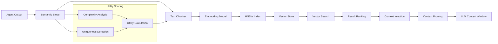

# APEX Memory Architecture & Vector Store Analysis

## Executive Summary

The APEX system implements a sophisticated multi-tiered memory architecture that combines short-term context management with long-term semantic storage. The design leverages vector embeddings, HNSW indexing, and intelligent filtering to create an efficient, scalable memory system that supports agent learning and context retention.

## 1. Memory Architecture Overview

### 1.1 Multi-Tiered Memory Hierarchy


### 1.2 Data Flow Architecture



## 2. L1: Active Context Management

### 2.1 Context Window Optimization

```python
class ContextManager:
    """Manages L1 context window with intelligent pruning"""
    
    def __init__(self, max_context_tokens=8000):
        self.max_context_tokens = max_context_tokens
        self.context_history = []
        self.retention_cache = {}
        
        # Pruning parameters
        self.recent_turns_kept = 3  # Always keep last 3 turns
        self.salience_threshold = 0.5
        self.max_token_ratio = 0.8  # 80% of max tokens
    
    def add_context_turn(self, turn_data):
        """Add a new turn to context history"""
        context_turn = {
            'id': str(uuid.uuid4()),
            'timestamp': datetime.now(timezone.utc),
            'role': turn_data['role'],  # user, assistant, system
            'content': turn_data['content'],
            'token_count': self._estimate_tokens(turn_data['content']),
            'salience': turn_data.get('salience', 0.5),
            'recency': 1.0,  # Will decay over time
            'task_relevance': turn_data.get('task_relevance', 0.5),
            'metadata': turn_data.get('metadata', {}),
        }
        
        self.context_history.append(context_turn)
        
        # Update recency scores
        self._update_recency_scores()
        
        # Prune if necessary
        if self._get_total_tokens() > self.max_context_tokens * self.max_token_ratio:
            self._prune_context()
    
    def _prune_context(self):
        """Prune context using information bottleneck principle"""
        # Always keep last N turns
        recent_turns = self.context_history[-self.recent_turns_kept:]
        
        # Calculate retention scores for older turns
        older_turns = self.context_history[:-self.recent_turns_kept]
        
        scored_turns = []
        for turn in older_turns:
            retention_score = self._calculate_retention_score(turn)
            scored_turns.append((turn, retention_score))
        
        # Sort by retention score (descending)
        scored_turns.sort(key=lambda x: x[1], reverse=True)
        
        # Select turns that fit in token budget
        selected_turns = []
        remaining_tokens = self.max_context_tokens - self._count_tokens(recent_turns)
        
        for turn, score in scored_turns:
            if turn['token_count'] <= remaining_tokens and score >= self.salience_threshold:
                selected_turns.append(turn)
                remaining_tokens -= turn['token_count']
        
        # Rebuild context history
        self.context_history = selected_turns + recent_turns
    
    def _calculate_retention_score(self, turn):
        """Calculate retention score using information bottleneck"""
        # R_s = (Salience × Recency × TaskRelevance) / TokenCost
        
        salience = turn['salience']
        recency = turn['recency']
        task_relevance = turn['task_relevance']
        token_cost = max(turn['token_count'], 1)  # Avoid division by zero
        
        retention_score = (salience * recency * task_relevance) / token_cost
        
        # Apply time decay
        age_hours = (datetime.now(timezone.utc) - turn['timestamp']).total_seconds() / 3600
        time_decay = math.exp(-age_hours / 24)  # 24-hour half-life
        
        return retention_score * time_decay
    
    def _update_recency_scores(self):
        """Update recency scores for all turns"""
        now = datetime.now(timezone.utc)
        
        for turn in self.context_history:
            age_hours = (now - turn['timestamp']).total_seconds() / 3600
            # Exponential decay
            turn['recency'] = math.exp(-age_hours / 12)  # 12-hour half-life
```

### 2.2 Information Bottleneck Optimization

```python
class InformationBottleneck:
    """Implements information bottleneck for context compression"""
    
    def __init__(self):
        self.compression_ratio = 0.3  # Target 30% compression
        self.preservation_threshold = 0.8  # Preserve 80% of information
        
    def compress_context(self, context_turns):
        """Compress context while preserving information"""
        if len(context_turns) <= 5:
            return context_turns  # No compression needed
        
        # Calculate mutual information
        mi_matrix = self._calculate_mutual_information(context_turns)
        
        # Identify redundant information
        redundant_turns = self._find_redundant_turns(mi_matrix)
        
        # Summarize redundant turns
        summarized_turns = []
        for turn_indices in redundant_turns:
            turns_to_summarize = [context_turns[i] for i in turn_indices]
            summary = self._summarize_turns(turns_to_summarize)
            summarized_turns.append(summary)
        
        # Combine with non-redundant turns
        non_redundant_indices = set(range(len(context_turns))) - set().union(*redundant_turns)
        non_redundant_turns = [context_turns[i] for i in non_redundant_indices]
        
        return non_redundant_turns + summarized_turns
    
    def _calculate_mutual_information(self, turns):
        """Calculate mutual information matrix between turns"""
        n = len(turns)
        mi_matrix = np.zeros((n, n))
        
        for i in range(n):
            for j in range(i + 1, n):
                # Use semantic similarity as proxy for mutual information
                similarity = self._semantic_similarity(turns[i], turns[j])
                mi_matrix[i][j] = similarity
                mi_matrix[j][i] = similarity
        
        return mi_matrix
    
    def _find_redundant_turns(self, mi_matrix, threshold=0.8):
        """Find groups of redundant turns"""
        n = mi_matrix.shape[0]
        visited = [False] * n
        redundant_groups = []
        
        for i in range(n):
            if visited[i]:
                continue
            
            # Find similar turns
            similar_indices = [i]
            for j in range(i + 1, n):
                if not visited[j] and mi_matrix[i][j] > threshold:
                    similar_indices.append(j)
                    visited[j] = True
            
            if len(similar_indices) > 1:
                redundant_groups.append(similar_indices)
            
            visited[i] = True
        
        return redundant_groups
```

## 3. L2: Semantic Vector Store

### 3.1 Vector Embedding Pipeline

```python
class EmbeddingPipeline:
    """Pipeline for generating and managing text embeddings"""
    
    def __init__(self, model_name="text-embedding-3-small", dimension=1536):
        self.model_name = model_name
        self.dimension = dimension
        self.embedding_cache = {}
        self.batch_size = 100
        
    async def embed_text(self, texts):
        """Generate embeddings for text(s)"""
        if isinstance(texts, str):
            texts = [texts]
        
        # Check cache
        cached_embeddings = []
        uncached_texts = []
        uncached_indices = []
        
        for i, text in texts:
            cache_key = self._get_cache_key(text)
            if cache_key in self.embedding_cache:
                cached_embeddings.append((i, self.embedding_cache[cache_key]))
            else:
                uncached_texts.append(text)
                uncached_indices.append(i)
        
        # Generate embeddings for uncached texts
        if uncached_texts:
            new_embeddings = await self._generate_embeddings(uncached_texts)
            
            # Cache new embeddings
            for text, embedding in zip(uncached_texts, new_embeddings):
                cache_key = self._get_cache_key(text)
                self.embedding_cache[cache_key] = embedding
        
        # Combine results
        all_embeddings = [None] * len(texts)
        
        # Fill cached embeddings
        for i, embedding in cached_embeddings:
            all_embeddings[i] = embedding
        
        # Fill new embeddings
        for i, embedding in zip(uncached_indices, new_embeddings):
            all_embeddings[i] = embedding
        
        return all_embeddings[0] if len(texts) == 1 else all_embeddings
    
    async def _generate_embeddings(self, texts):
        """Generate embeddings using the model"""
        embeddings = []
        
        # Process in batches
        for i in range(0, len(texts), self.batch_size):
            batch = texts[i:i + self.batch_size]
            
            # Call embedding model (implementation depends on provider)
            batch_embeddings = await self._call_embedding_model(batch)
            embeddings.extend(batch_embeddings)
        
        return embeddings
    
    def _get_cache_key(self, text):
        """Generate cache key for text"""
        # Use hash of text for cache key
        return hashlib.sha256(text.encode()).hexdigest()[:16]
```

### 3.2 HNSW Index Implementation

```python
class HNSWIndex:
    """Hierarchical Navigable Small World index for fast similarity search"""
    
    def __init__(self, dimension=1536, m=16, ef_construction=200, ef_search=100):
        self.dimension = dimension
        self.m = m  # Max connections per node
        self.ef_construction = ef_construction  # Index construction parameter
        self.ef_search = ef_search  # Search parameter
        
        # Index structure
        self.nodes = {}  # node_id -> Node
        self.entry_point = None
        self.max_level = 0
        
        # Statistics
        self.total_nodes = 0
        self.search_count = 0
        self.avg_search_time = 0.0
    
    def add_vector(self, vector_id, vector):
        """Add vector to HNSW index"""
        if len(vector) != self.dimension:
            raise ValueError(f"Vector dimension mismatch: expected {self.dimension}, got {len(vector)}")
        
        # Generate random level
        level = self._generate_random_level()
        
        # Create node
        node = HNSWNode(vector_id, vector, level)
        self.nodes[vector_id] = node
        
        # Update max level
        if level > self.max_level:
            self.max_level = level
        
        # Insert into index
        self._insert_node(node, level)
        
        self.total_nodes += 1
    
    def search(self, query_vector, k=5, min_similarity=0.82):
        """Search for k most similar vectors"""
        start_time = time.time()
        
        if not self.entry_point:
            return []
        
        # Normalize query vector
        query_vector = self._normalize_vector(query_vector)
        
        # Multi-layer search
        candidates = self._search_layers(query_vector, k)
        
        # Filter by minimum similarity
        results = []
        for candidate_id, similarity in candidates:
            if similarity >= min_similarity:
                node = self.nodes[candidate_id]
                results.append(MemoryChunk(
                    id=node.vector_id,
                    content=node.metadata.get('content', ''),
                    agent_id=node.metadata.get('agent_id', ''),
                    task_id=node.metadata.get('task_id', ''),
                    file_path=node.metadata.get('file_path', ''),
                    timestamp=node.metadata.get('timestamp', datetime.now()),
                    utility_score=node.metadata.get('utility_score', 0.0),
                    vector=node.vector,
                    status='active'
                ))
        
        # Update statistics
        search_time = time.time() - start_time
        self.search_count += 1
        self.avg_search_time = (
            (self.avg_search_time * (self.search_count - 1) + search_time) / 
            self.search_count
        )
        
        return results
    
    def _search_layers(self, query_vector, k):
        """Search through HNSW layers"""
        # Start from entry point at top level
        current_node = self.entry_point
        current_level = self.max_level
        
        # Greedy search through layers
        for level in range(self.max_level, -1, -1):
            current_node = self._search_layer(query_vector, current_node, level, 1)
        
        # Search at bottom level for k nearest neighbors
        candidates = self._search_layer(query_vector, current_node, 0, k)
        
        return candidates
    
    def _search_layer(self, query_vector, entry_node, level, k):
        """Search specific layer for nearest neighbors"""
        visited = set()
        candidates = []
        wlist = [(entry_node, self._cosine_similarity(query_vector, entry_node.vector))]
        
        while wlist:
            # Get furthest element from working list
            current_node, current_dist = heapq.heappop(wlist)
            
            if current_node.vector_id in visited:
                continue
            
            visited.add(current_node.vector_id)
            
            # Add to candidates if we have room or if closer than worst candidate
            if len(candidates) < k:
                heapq.heappush(candidates, (current_dist, current_node.vector_id))
            elif current_dist < -candidates[0][0]:  # Max heap behavior
                heapq.heapreplace(candidates, (current_dist, current_node.vector_id))
            
            # Check neighbors
            for neighbor in current_node.connections[level]:
                if neighbor.vector_id not in visited:
                    neighbor_dist = self._cosine_similarity(query_vector, neighbor.vector)
                    
                    if len(candidates) < k or neighbor_dist < -candidates[0][0]:
                        heapq.heappush(wlist, (neighbor_dist, neighbor))
        
        # Convert to list of (vector_id, similarity)
        results = [(vector_id, -dist) for dist, vector_id in candidates]
        results.sort(key=lambda x: x[1], reverse=True)
        
        return results


class HNSWNode:
    """Node in HNSW index"""
    
    def __init__(self, vector_id, vector, level):
        self.vector_id = vector_id
        self.vector = vector
        self.level = level
        self.connections = [[] for _ in range(level + 1)]  # Connections per level
        self.metadata = {}  # Additional metadata
```

### 3.3 Vector Store Backend Abstraction

```python
class VectorStore:
    """Abstract interface for vector store backends"""
    
    def __init__(self, backend="chromadb", dimension=1536):
        self.backend = backend
        self.dimension = dimension
        self.index = None
        
        if backend == "chromadb":
            self.index = ChromaDBIndex(dimension)
        elif backend == "faiss":
            self.index = FAISSIndex(dimension)
        elif backend == "hnsw_custom":
            self.index = HNSWIndex(dimension)
        else:
            raise ValueError(f"Unknown backend: {backend}")
    
    async def add_memory(self, chunk):
        """Add memory chunk to vector store"""
        # Generate embedding if not provided
        if chunk.vector is None:
            embedding_pipeline = get_embedding_pipeline()
            chunk.vector = await embedding_pipeline.embed_text(chunk.content)
        
        # Add to index
        self.index.add_vector(chunk.id, chunk.vector)
        
        # Store metadata
        self.index.nodes[chunk.id].metadata.update({
            'content': chunk.content,
            'agent_id': chunk.agent_id,
            'task_id': chunk.task_id,
            'file_path': chunk.file_path,
            'timestamp': chunk.timestamp,
            'utility_score': chunk.utility_score,
        })
        
        return chunk.id
    
    async def search(self, query_vector, top_k=5, min_similarity=0.82):
        """Search for similar memories"""
        return self.index.search(query_vector, top_k, min_similarity)
    
    async def deprecate_memory(self, memory_id, superseded_by):
        """Mark memory as deprecated"""
        if memory_id in self.index.nodes:
            node = self.index.nodes[memory_id]
            node.metadata['status'] = 'deprecated'
            node.metadata['superseded_by'] = superseded_by


class ChromaDBIndex:
    """ChromaDB backend implementation"""
    
    def __init__(self, dimension):
        import chromadb
        self.client = chromadb.Client()
        self.collection = self.client.get_or_create_collection(
            name="apex_memory",
            metadata={"hnsw:space": "cosine"}
        )
        self.dimension = dimension
    
    def add_vector(self, vector_id, vector):
        """Add vector to ChromaDB"""
        self.collection.add(
            ids=[vector_id],
            embeddings=[vector],
            documents=[f"Document {vector_id}"]
        )
    
    def search(self, query_vector, top_k=5, min_similarity=0.82):
        """Search ChromaDB"""
        results = self.collection.query(
            query_embeddings=[query_vector],
            n_results=top_k
        )
        
        # Convert to MemoryChunk objects
        memories = []
        for i, vector_id in enumerate(results['ids'][0]):
            similarity = 1 - results['distances'][0][i]  # Convert distance to similarity
            
            if similarity >= min_similarity:
                memories.append(MemoryChunk(
                    id=vector_id,
                    content=results['documents'][0][i],
                    vector=query_vector,  # Placeholder
                    utility_score=similarity
                ))
        
        return memories
```

## 4. L3: Archival Storage System

### 4.1 Parquet-based Cold Storage

```python
class ArchivalStorage:
    """Manages L3 archival storage in Parquet format"""
    
    def __init__(self, storage_path, compression='snappy'):
        self.storage_path = Path(storage_path)
        self.compression = compression
        self.partition_cols = ['year', 'month', 'day']
        
        # Ensure storage directory exists
        self.storage_path.mkdir(parents=True, exist_ok=True)
    
    async def archive_memories(self, memories):
        """Archive memories to Parquet storage"""
        if not memories:
            return
        
        # Convert to DataFrame
        df = pd.DataFrame([
            {
                'id': memory.id,
                'content': memory.content,
                'agent_id': memory.agent_id,
                'task_id': memory.task_id,
                'file_path': memory.file_path,
                'timestamp': memory.timestamp,
                'utility_score': memory.utility_score,
                'status': memory.status,
                'superseded_by': memory.superseded_by,
                'year': memory.timestamp.year,
                'month': memory.timestamp.month,
                'day': memory.timestamp.day,
            }
            for memory in memories
        ])
        
        # Write to Parquet with partitioning
        table = pa.Table.from_pandas(df)
        
        file_path = self.storage_path / f"memories_{datetime.now().strftime('%Y%m%d_%H%M%S')}.parquet"
        
        pq.write_table(
            table,
            file_path,
            compression=self.compression,
            partition_cols=self.partition_cols,
            write_metadata_file=True
        )
        
        logger.info(f"Archived {len(memories)} memories to {file_path}")
    
    async def query_archived_memories(self, filters=None, limit=1000):
        """Query archived memories"""
        # Build dataset path
        dataset_path = self.storage_path / "memories"
        
        if not dataset_path.exists():
            return []
        
        # Load dataset
        dataset = ds.dataset(dataset_path, format="parquet", partitioning="hive")
        
        # Apply filters
        if filters:
            filter_expr = self._build_filter_expression(filters)
            dataset = dataset.filter(filter_expr)
        
        # Load data
        table = dataset.to_table(limit=limit)
        df = table.to_pandas()
        
        # Convert to MemoryChunk objects
        memories = []
        for _, row in df.iterrows():
            memory = MemoryChunk(
                id=row['id'],
                content=row['content'],
                agent_id=row['agent_id'],
                task_id=row['task_id'],
                file_path=row['file_path'],
                timestamp=row['timestamp'],
                utility_score=row['utility_score'],
                status=row['status'],
                superseded_by=row['superseded_by']
            )
            memories.append(memory)
        
        return memories
    
    def _build_filter_expression(self, filters):
        """Build filter expression for dataset"""
        expressions = []
        
        for field, value in filters.items():
            if field in ['agent_id', 'task_id', 'status']:
                expressions.append(ds.field(field) == value)
            elif field == 'timestamp':
                if isinstance(value, dict):
                    if 'start' in value:
                        expressions.append(ds.field('timestamp') >= value['start'])
                    if 'end' in value:
                        expressions.append(ds.field('timestamp') <= value['end'])
            elif field == 'utility_score':
                if isinstance(value, dict):
                    if 'min' in value:
                        expressions.append(ds.field('utility_score') >= value['min'])
                    if 'max' in value:
                        expressions.append(ds.field('utility_score') <= value['max'])
        
        return reduce(lambda x, y: x & y, expressions) if expressions else None
```

### 4.2 Lifecycle Management

```python
class MemoryLifecycleManager:
    """Manages memory lifecycle and tier migration"""
    
    def __init__(self):
        self.tier_thresholds = {
            'l2_to_l3_days': 30,  # Move to archival after 30 days
            'l3_cleanup_days': 365,  # Delete from archival after 1 year
            'min_access_count': 5,  # Keep frequently accessed memories
            'utility_threshold': 0.3,  # Minimum utility to keep
        }
        
        self.access_tracker = {}
        self.migration_queue = asyncio.Queue()
        
        # Start background tasks
        asyncio.create_task(self._lifecycle_monitor())
        asyncio.create_task(self._migration_worker())
    
    async def track_access(self, memory_id):
        """Track memory access for lifecycle decisions"""
        if memory_id not in self.access_tracker:
            self.access_tracker[memory_id] = {
                'access_count': 0,
                'last_access': datetime.now(timezone.utc),
                'first_access': datetime.now(timezone.utc),
            }
        
        self.access_tracker[memory_id]['access_count'] += 1
        self.access_tracker[memory_id]['last_access'] = datetime.now(timezone.utc)
    
    async def _lifecycle_monitor(self):
        """Monitor memory lifecycle and schedule migrations"""
        while True:
            try:
                # Check for memories to migrate
                await self._check_l2_to_l3_migration()
                await self._check_l3_cleanup()
                
                # Sleep for 1 hour
                await asyncio.sleep(3600)
                
            except Exception as e:
                logger.error(f"Lifecycle monitor error: {e}")
                await asyncio.sleep(300)  # Retry after 5 minutes
    
    async def _check_l2_to_l3_migration(self):
        """Check for memories to migrate from L2 to L3"""
        vector_store = get_vector_store()
        archival_storage = get_archival_storage()
        
        # Get old memories
        cutoff_date = datetime.now(timezone.utc) - timedelta(days=self.tier_thresholds['l2_to_l3_days'])
        
        for memory_id, node in vector_store.index.nodes.items():
            metadata = node.metadata
            timestamp = metadata.get('timestamp')
            
            if timestamp and timestamp < cutoff_date:
                access_info = self.access_tracker.get(memory_id, {})
                
                # Check if memory should be archived
                if self._should_archive(memory_id, metadata, access_info):
                    # Schedule migration
                    await self.migration_queue.put({
                        'type': 'l2_to_l3',
                        'memory_id': memory_id,
                        'metadata': metadata,
                    })
    
    def _should_archive(self, memory_id, metadata, access_info):
        """Determine if memory should be archived"""
        # Keep high utility memories
        if metadata.get('utility_score', 0) > self.tier_thresholds['utility_threshold']:
            return False
        
        # Keep frequently accessed memories
        if access_info.get('access_count', 0) > self.tier_thresholds['min_access_count']:
            return False
        
        # Keep recently accessed memories
        if access_info.get('last_access'):
            days_since_access = (datetime.now(timezone.utc) - access_info['last_access']).days
            if days_since_access < 7:
                return False
        
        return True
```

## 5. Semantic Sieve & Utility Scoring

### 5.1 Semantic Sieve Implementation

```python
class SemanticSieve:
    """Filters and scores memory chunks before embedding"""
    
    def __init__(self, utility_threshold=0.3):
        self.utility_threshold = utility_threshold
        self.complexity_analyzer = ComplexityAnalyzer()
        self.uniqueness_detector = UniquenessDetector()
    
    def process_content(self, content, agent_id, task_id=None, file_path=None):
        """Process content and decide whether to embed"""
        # Analyze complexity
        complexity = self.complexity_analyzer.analyze(content)
        
        # Analyze uniqueness
        uniqueness = self.uniqueness_detector.detect_uniqueness(content)
        
        # Calculate utility score
        utility_score = self._calculate_utility_score(complexity, uniqueness)
        
        # Decide whether to embed
        if utility_score < self.utility_threshold:
            return None
        
        # Create memory chunk
        memory_chunk = MemoryChunk(
            id=str(uuid.uuid4()),
            content=content,
            agent_id=agent_id,
            task_id=task_id,
            file_path=file_path,
            timestamp=datetime.now(timezone.utc),
            utility_score=utility_score,
            status='active'
        )
        
        return memory_chunk
    
    def _calculate_utility_score(self, complexity, uniqueness):
        """Calculate utility score using weighted formula"""
        # U_s = (Complexity × 0.4) + (Uniqueness × 0.6)
        utility_score = (complexity * 0.4) + (uniqueness * 0.6)
        return utility_score
    
    def chunk_text(self, text, chunk_size=1024, overlap=128):
        """Split text into overlapping chunks"""
        if len(text) <= chunk_size:
            return [text]
        
        chunks = []
        start = 0
        
        while start < len(text):
            end = min(start + chunk_size, len(text))
            chunks.append(text[start:end])
            start = end - overlap
        
        return chunks


class ComplexityAnalyzer:
    """Analyzes text complexity"""
    
    def __init__(self):
        self.stop_words = set(['the', 'a', 'an', 'and', 'or', 'but', 'in', 'on', 'at', 'to', 'for'])
    
    def analyze(self, text):
        """Analyze text complexity (0.0 - 1.0)"""
        # Token-based complexity
        tokens = word_tokenize(text.lower())
        
        # Vocabulary richness
        unique_tokens = set(tokens)
        vocab_richness = len(unique_tokens) / len(tokens) if tokens else 0
        
        # Average word length
        avg_word_length = sum(len(word) for word in tokens) / len(tokens) if tokens else 0
        
        # Sentence complexity
        sentences = sent_tokenize(text)
        avg_sentence_length = len(tokens) / len(sentences) if sentences else 0
        
        # Technical terms (simplified)
        technical_terms = self._count_technical_terms(text)
        technical_density = technical_terms / len(tokens) if tokens else 0
        
        # Combine metrics
        complexity = (
            vocab_richness * 0.3 +
            min(avg_word_length / 10, 1.0) * 0.2 +
            min(avg_sentence_length / 20, 1.0) * 0.3 +
            technical_density * 0.2
        )
        
        return min(complexity, 1.0)
    
    def _count_technical_terms(self, text):
        """Count technical terms in text"""
        # Simplified technical term detection
        technical_patterns = [
            r'\b[A-Z]{2,}\b',  # Acronyms
            r'\b\w+_\w+\b',  # Snake case
            r'\b\w+\(\)',    # Function calls
            r'\b\w+\.\w+\b', # Method calls
        ]
        
        count = 0
        for pattern in technical_patterns:
            matches = re.findall(pattern, text)
            count += len(matches)
        
        return count


class UniquenessDetector:
    """Detects uniqueness of content"""
    
    def __init__(self):
        self.content_hashes = {}
        self.ngram_threshold = 0.7
    
    def detect_uniqueness(self, content):
        """Detect content uniqueness (0.0 - 1.0)"""
        # Generate content hash
        content_hash = hashlib.md5(content.encode()).hexdigest()
        
        # Check exact duplicates
        if content_hash in self.content_hashes:
            return 0.0
        
        # N-gram similarity with existing content
        max_similarity = 0.0
        content_ngrams = self._generate_ngrams(content, 3)
        
        for existing_hash, existing_ngrams in self.content_hashes.items():
            similarity = self._ngram_similarity(content_ngrams, existing_ngrams)
            max_similarity = max(max_similarity, similarity)
        
        # Store content ngrams
        self.content_hashes[content_hash] = content_ngrams
        
        # Calculate uniqueness score
        uniqueness = 1.0 - max_similarity
        return uniqueness
    
    def _generate_ngrams(self, text, n):
        """Generate n-grams from text"""
        words = word_tokenize(text.lower())
        ngrams = set()
        
        for i in range(len(words) - n + 1):
            ngram = ' '.join(words[i:i+n])
            ngrams.add(ngram)
        
        return ngrams
    
    def _ngram_similarity(self, ngrams1, ngrams2):
        """Calculate Jaccard similarity between n-gram sets"""
        intersection = len(ngrams1.intersection(ngrams2))
        union = len(ngrams1.union(ngrams2))
        
        return intersection / union if union > 0 else 0.0
```

## 6. Performance Optimization

### 6.1 Caching Strategies

```python
class MemoryCache:
    """Multi-level caching for memory operations"""
    
    def __init__(self):
        # L1: In-memory cache (recent queries)
        self.l1_cache = {}
        self.l1_max_size = 1000
        self.l1_ttl = 300  # 5 minutes
        
        # L2: Redis cache (shared across instances)
        self.redis_client = redis.Redis()
        self.l2_ttl = 3600  # 1 hour
        
        # Cache statistics
        self.cache_hits = 0
        self.cache_misses = 0
    
    async def get(self, key, level='l1'):
        """Get value from cache"""
        # Try L1 cache first
        if key in self.l1_cache:
            entry = self.l1_cache[key]
            if time.time() - entry['timestamp'] < self.l1_ttl:
                self.cache_hits += 1
                return entry['value']
            else:
                del self.l1_cache[key]
        
        # Try L2 cache
        if level == 'l2':
            try:
                value = await self.redis_client.get(key)
                if value:
                    self.cache_hits += 1
                    # Promote to L1
                    self._set_l1(key, value)
                    return value
            except Exception:
                pass
        
        self.cache_misses += 1
        return None
    
    async def set(self, key, value, ttl=None):
        """Set value in cache"""
        # Set in L1
        self._set_l1(key, value)
        
        # Set in L2
        if ttl is None:
            ttl = self.l2_ttl
        
        try:
            await self.redis_client.setex(key, ttl, value)
        except Exception:
            pass
    
    def _set_l1(self, key, value):
        """Set value in L1 cache"""
        # Evict if necessary
        if len(self.l1_cache) >= self.l1_max_size:
            # LRU eviction
            oldest_key = min(self.l1_cache.keys(), 
                           key=lambda k: self.l1_cache[k]['timestamp'])
            del self.l1_cache[oldest_key]
        
        self.l1_cache[key] = {
            'value': value,
            'timestamp': time.time(),
        }
```

### 6.2 Batch Processing Optimization

```python
class BatchProcessor:
    """Batch processing for memory operations"""
    
    def __init__(self, batch_size=100, flush_interval=5.0):
        self.batch_size = batch_size
        self.flush_interval = flush_interval
        
        self.pending_additions = []
        self.pending_deprecations = []
        self.last_flush = time.time()
        
        # Start background flush task
        asyncio.create_task(self._flush_loop())
    
    async def add_memory(self, memory_chunk):
        """Queue memory for batch addition"""
        self.pending_additions.append(memory_chunk)
        
        if (len(self.pending_additions) >= self.batch_size or
            time.time() - self.last_flush > self.flush_interval):
            await self._flush_additions()
    
    async def deprecate_memory(self, memory_id, superseded_by):
        """Queue memory for batch deprecation"""
        self.pending_deprecations.append((memory_id, superseded_by))
        
        if len(self.pending_deprecations) >= self.batch_size:
            await self._flush_deprecations()
    
    async def _flush_loop(self):
        """Background loop for periodic flushing"""
        while True:
            await asyncio.sleep(self.flush_interval)
            
            if self.pending_additions:
                await self._flush_additions()
            
            if self.pending_deprecations:
                await self._flush_deprecations()
    
    async def _flush_additions(self):
        """Flush pending additions to vector store"""
        if not self.pending_additions:
            return
        
        vector_store = get_vector_store()
        
        # Batch add memories
        for memory_chunk in self.pending_additions:
            await vector_store.add_memory(memory_chunk)
        
        logger.info(f"Flushed {len(self.pending_additions)} memory additions")
        self.pending_additions.clear()
        self.last_flush = time.time()
    
    async def _flush_deprecations(self):
        """Flush pending deprecations to vector store"""
        if not self.pending_deprecations:
            return
        
        vector_store = get_vector_store()
        
        # Batch deprecate memories
        for memory_id, superseded_by in self.pending_deprecations:
            await vector_store.deprecate_memory(memory_id, superseded_by)
        
        logger.info(f"Flushed {len(self.pending_deprecations)} memory deprecations")
        self.pending_deprecations.clear()
```

## 7. Monitoring & Analytics

### 7.1 Memory System Metrics

```python
class MemoryMetrics:
    """Collect and analyze memory system metrics"""
    
    def __init__(self):
        self.metrics = {
            'total_memories': 0,
            'active_memories': 0,
            'deprecated_memories': 0,
            'archived_memories': 0,
            'avg_utility_score': 0.0,
            'storage_usage': {
                'l1_context': 0,
                'l2_vector': 0,
                'l3_archival': 0,
            },
            'performance': {
                'embeddings_per_second': 0.0,
                'search_latency_ms': 0.0,
                'cache_hit_rate': 0.0,
            },
        }
    
    async def update_metrics(self):
        """Update all metrics"""
        vector_store = get_vector_store()
        archival_storage = get_archival_storage()
        context_manager = get_context_manager()
        
        # Count memories by status
        self.metrics['total_memories'] = len(vector_store.index.nodes)
        self.metrics['active_memories'] = sum(
            1 for node in vector_store.index.nodes.values()
            if node.metadata.get('status') == 'active'
        )
        self.metrics['deprecated_memories'] = sum(
            1 for node in vector_store.index.nodes.values()
            if node.metadata.get('status') == 'deprecated'
        )
        
        # Calculate average utility score
        active_nodes = [
            node for node in vector_store.index.nodes.values()
            if node.metadata.get('status') == 'active'
        ]
        
        if active_nodes:
            self.metrics['avg_utility_score'] = sum(
                node.metadata.get('utility_score', 0.0) for node in active_nodes
            ) / len(active_nodes)
        
        # Storage usage
        self.metrics['storage_usage']['l1_context'] = self._estimate_context_size()
        self.metrics['storage_usage']['l2_vector'] = self._estimate_vector_store_size()
        self.metrics['storage_usage']['l3_archival'] = await self._estimate_archival_size()
        
        # Performance metrics
        self.metrics['performance']['search_latency_ms'] = vector_store.index.avg_search_time * 1000
        
        cache = get_memory_cache()
        total_requests = cache.cache_hits + cache.cache_misses
        if total_requests > 0:
            self.metrics['performance']['cache_hit_rate'] = cache.cache_hits / total_requests
    
    def get_health_status(self):
        """Get memory system health status"""
        health_issues = []
        
        # Check storage usage
        total_storage = sum(self.metrics['storage_usage'].values())
        if total_storage > 10 * 1024 * 1024 * 1024:  # > 10GB
            health_issues.append("High storage usage")
        
        # Check cache hit rate
        if self.metrics['performance']['cache_hit_rate'] < 0.5:
            health_issues.append("Low cache hit rate")
        
        # Check search latency
        if self.metrics['performance']['search_latency_ms'] > 100:
            health_issues.append("High search latency")
        
        # Check utility score
        if self.metrics['avg_utility_score'] < 0.3:
            health_issues.append("Low average utility score")
        
        if health_issues:
            return 'unhealthy', health_issues
        elif len(health_issues) > 0:
            return 'degraded', health_issues
        else:
            return 'healthy', []
```

## 8. Future Enhancements

### 8.1 Planned Improvements

1. **Distributed Vector Store**: Multi-node vector database
2. **Advanced Compression**: Better embedding compression
3. **Semantic Compression**: Content-aware compression
4. **Real-time Indexing**: Stream processing for live updates
5. **Cross-modal Memory**: Support for images, audio, video

### 8.2 Research Directions

1. **Neural Memory Networks**: Biologically inspired memory
2. **Hierarchical Memory**: Multi-scale memory organization
3. **Forgetting Mechanisms**: Intelligent memory pruning
4. **Memory Consolidation**: Sleep-like memory processing
5. **Episodic Memory**: Time-based memory organization

## 9. Best Practices & Guidelines

### 9.1 Memory Management Guidelines

1. **Utility-First**: Only store high-utility content
2. **Regular Cleanup**: Periodic memory maintenance
3. **Access Tracking**: Monitor memory access patterns
4. **Tier Migration**: Automatic tier management
5. **Compression**: Optimize storage efficiency

### 9.2 Performance Optimization

1. **Batch Operations**: Group similar operations
2. **Caching**: Multi-level caching strategy
3. **Index Optimization**: Tune HNSW parameters
4. **Async Processing**: Non-blocking operations
5. **Resource Monitoring**: Track system resources

### 9.3 Quality Assurance

1. **Embedding Quality**: Validate embedding models
2. **Search Accuracy**: Test search relevance
3. **Storage Integrity**: Verify data consistency
4. **Performance Benchmarks**: Regular performance testing
5. **Capacity Planning**: Monitor storage trends

This comprehensive memory architecture provides a robust, scalable foundation for APEX's agent memory system, with careful attention to performance, efficiency, and long-term sustainability. The multi-tiered design ensures optimal access patterns while maintaining the ability to store and retrieve vast amounts of semantic information.