# APEX System Architecture & Data Flow Documentation

## 1. High-Level System Architecture

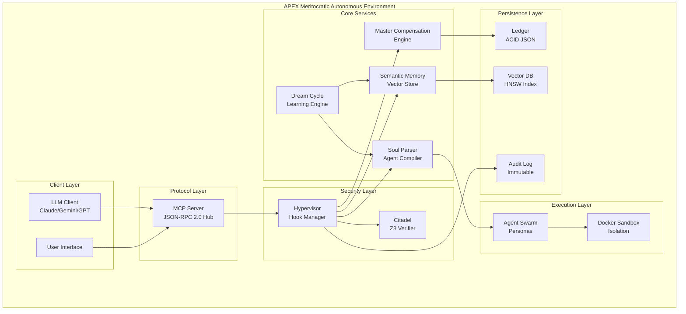

## 2. Component Interaction Matrix

| Component | MCP Server | Hypervisor | Citadel | MCE | Soul Parser | Dream Cycle | Memory | Agents |
|-----------|------------|------------|---------|-----|-------------|-------------|--------|--------|
| **MCP Server** | - | ✓ | ✓ | ✓ | ✓ | ✓ | ✓ | ✓ |
| **Hypervisor** | ✓ | - | ✓ | ✓ | ✓ | - | ✓ | ✓ |
| **Citadel** | ✓ | ✓ | - | ✓ | - | - | - | - |
| **MCE** | ✓ | ✓ | ✓ | - | - | - | - | ✓ |
| **Soul Parser** | ✓ | ✓ | - | - | - | ✓ | - | ✓ |
| **Dream Cycle** | ✓ | - | - | - | ✓ | - | ✓ | - |
| **Memory** | ✓ | ✓ | - | - | - | ✓ | - | ✓ |
| **Agents** | ✓ | ✓ | - | ✓ | ✓ | - | ✓ | - |

## 3. Detailed Data Flow Diagrams

### 3.1 Agent Task Execution Flow

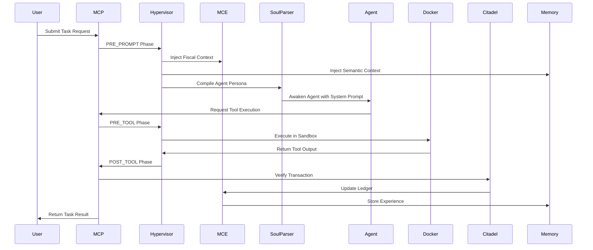

### 3.2 Financial Transaction Flow

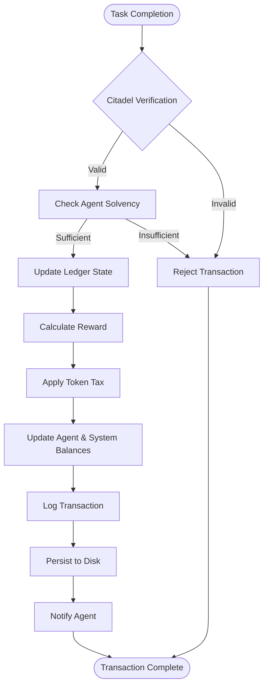

### 3.3 Memory Storage & Retrieval Flow

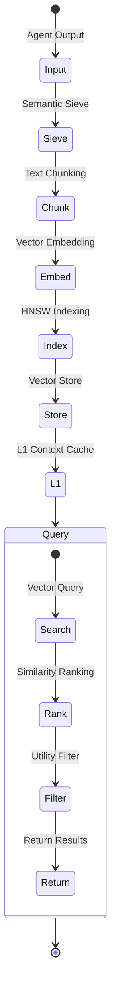

### 3.4 Hook Execution Pipeline

```mermaid
graph LR
    subgraph "PRE_PROMPT Phase"
        P1[fiscal_injector<br/>Priority 5]
        P2[memory_context_injector<br/>Priority 10]
    end
    
    subgraph "PRE_TOOL Phase"
        T1[python_ast_guard<br/>Priority 25]
        T2[bash_regex_guard<br/>Priority 30]
        T3[resource_metering<br/>Priority 40]
    end
    
    subgraph "POST_TOOL Phase"
        O1[self_healing_retry<br/>Priority 60]
        O2[output_sanitization<br/>Priority 70]
        O3[audit_logging<br/>Priority 90]
    end
    
    INPUT[Request/Input] --> P1
    P1 --> P2
    P2 --> AGENT_EXEC[Agent Execution]
    AGENT_EXEC --> T1
    T1 --> T2
    T2 --> T3
    T3 --> TOOL_EXEC[Tool Execution]
    TOOL_EXEC --> O1
    O1 --> O2
    O2 --> O3
    O3 --> OUTPUT[Response/Output]
```

## 4. Module Dependency Graph

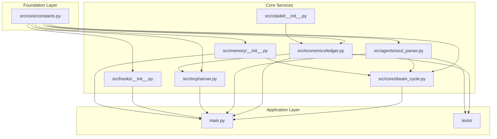

## 5. State Machine Diagrams

### 5.1 Agent Lifecycle State Machine

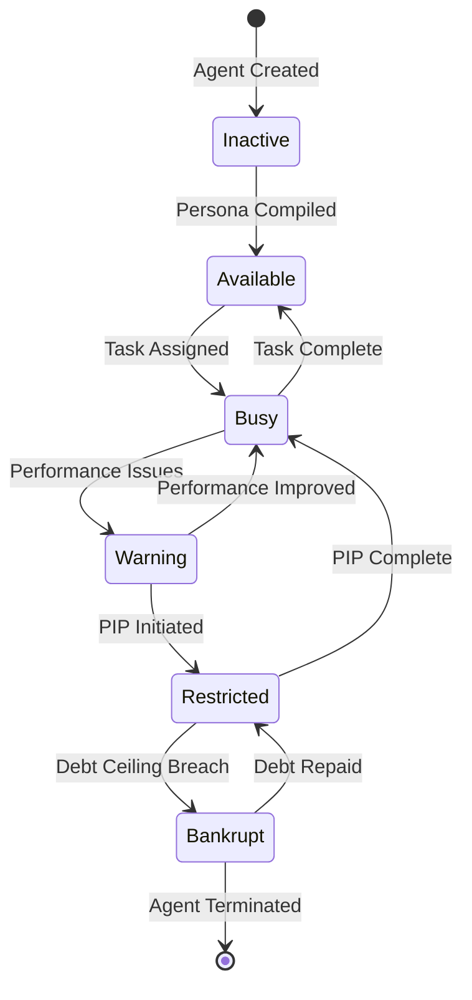

### 5.2 MCP Request State Machine

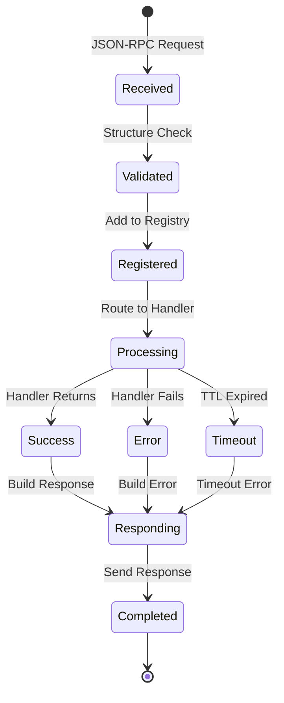

### 5.3 Transaction State Machine

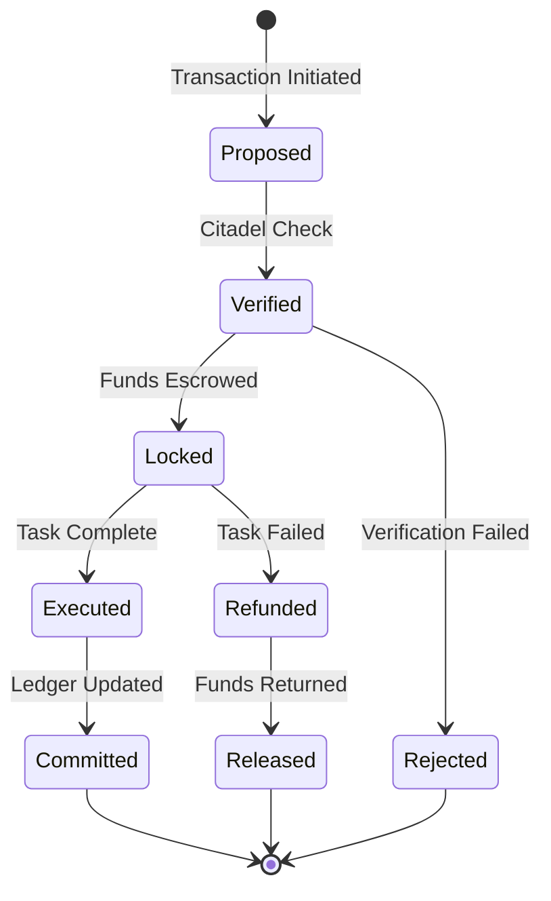

## 6. Data Model Relationships

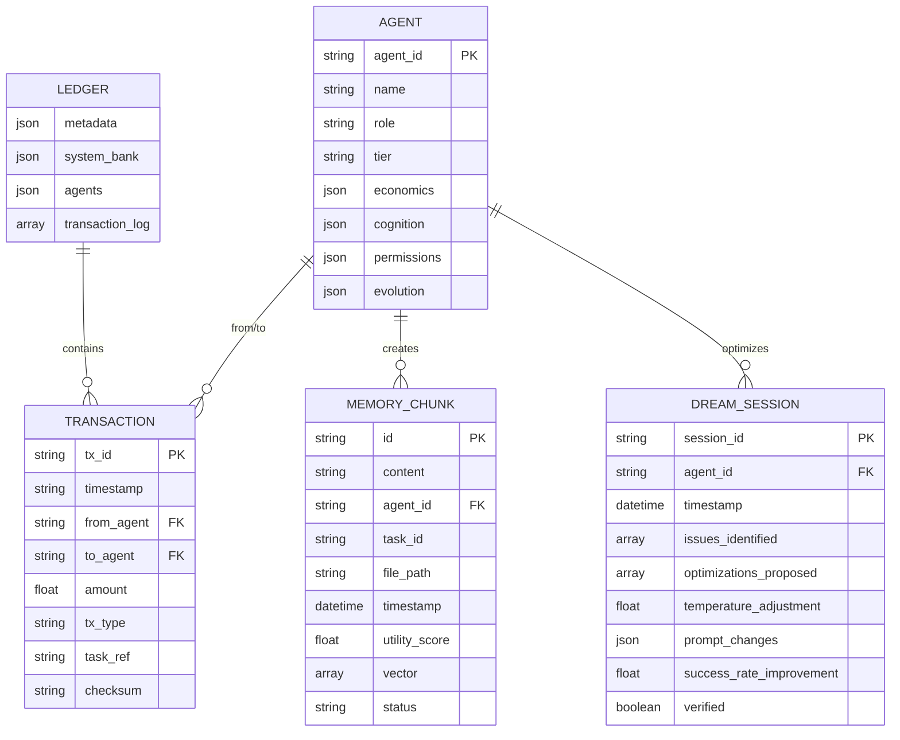

## 7. Security Architecture Flow

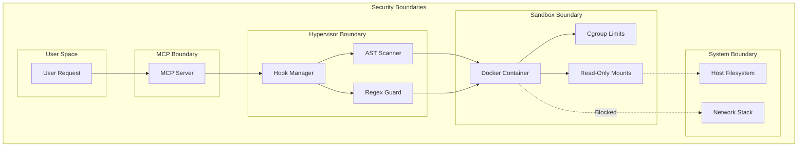

## 8. Performance Optimization Points

### 8.1 Critical Path Analysis

1. **MCP Request Handling** (Latency Critical)
   - Async I/O optimization
   - Request batching
   - Connection pooling

2. **Ledger Operations** (Throughput Critical)
   - Write-ahead logging
   - Batch commits
   - In-memory caching

3. **Vector Search** (Latency Critical)
   - HNSW optimization
   - Query caching
   - Approximate search

4. **Agent Compilation** (Startup Critical)
   - Persona caching
   - Pre-compilation
   - Template optimization

### 8.2 Bottleneck Identification

```mermaid
graph LR
    INPUT[Input Request] --> P1[Parse: 1ms]
    P1 --> P2[Hook PRE_PROMPT: 5ms]
    P2 --> P3[Agent LLM Call: 100-1000ms]
    P3 --> P4[Hook PRE_TOOL: 2ms]
    P4 --> P5[Tool Execution: 10-5000ms]
    P5 --> P6[Hook POST_TOOL: 3ms]
    P6 --> P7[Ledger Update: 5ms]
    P7 --> P8[Memory Store: 10ms]
    P8 --> OUTPUT[Response: 1ms]
    
    style P3 fill:#ff9999
    style P5 fill:#ff9999
```

## 9. Scaling Architecture

### 9.1 Horizontal Scaling Points

1. **MCP Server Cluster**
   - Load balancer distribution
   - Shared state via Redis
   - Request affinity

2. **Agent Pool**
   - Dynamic scaling
   - Resource allocation
   - Load-based routing

3. **Vector Store Cluster**
   - Sharded indexing
   - Distributed search
   - Replication

### 9.2 Vertical Scaling Considerations

1. **Memory Requirements**
   - Agent context: 1-10MB per agent
   - Vector cache: 2-10GB
   - Ledger cache: 100MB-1GB

2. **CPU Requirements**
   - LLM inference: GPU preferred
   - Vector operations: Multi-core
   - Transaction processing: Single-threaded

3. **Storage Requirements**
   - Ledger: 100MB-1GB
   - Vector DB: 10-100GB
   - Audit logs: 1-10GB/day

## 10. Failure Mode Analysis

### 10.1 Single Points of Failure

1. **Ledger File**
   - Mitigation: WAL + backups
   - Recovery: Replay from WAL

2. **MCP Server**
   - Mitigation: Process supervision
   - Recovery: Automatic restart

3. **Docker Daemon**
   - Mitigation: Health checks
   - Recovery: Service restart

### 10.2 Cascade Failure Prevention

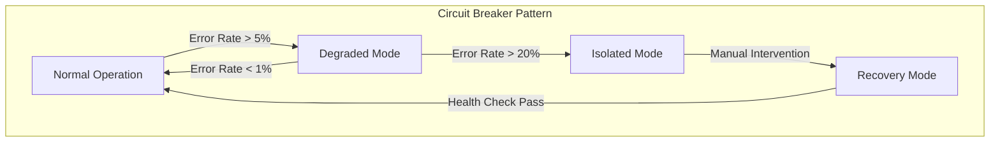

This architecture documentation provides a comprehensive view of the APEX system's structure, data flows, and operational characteristics. The diagrams illustrate the complex interactions between components while maintaining clarity about the system's design principles and security boundaries.