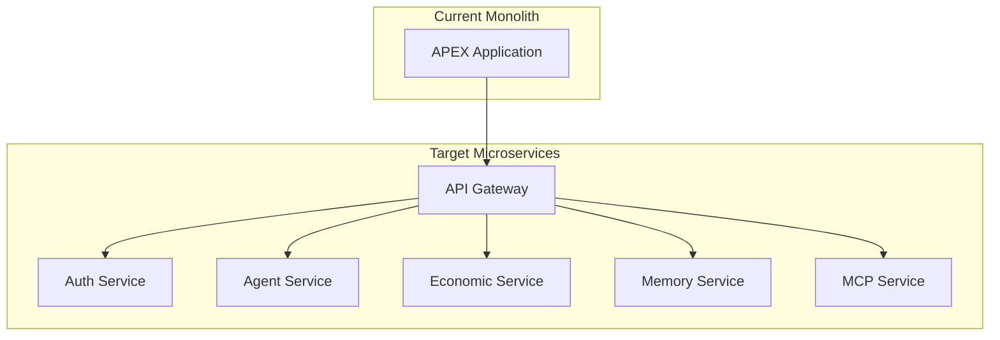
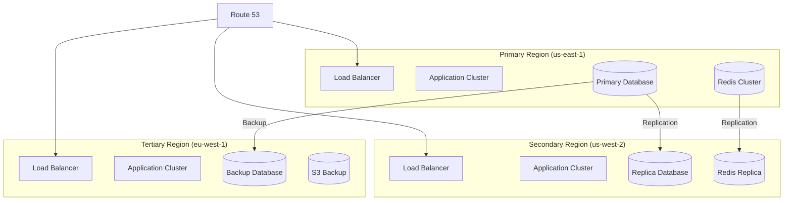

# APEX Technical Debt & Improvement Analysis

## Executive Summary

This document identifies technical debt, improvement opportunities, and strategic recommendations for the APEX Agent Payroll System. The analysis covers code quality, architecture, performance, security, and operational readiness to provide a roadmap for system enhancement and long-term maintainability.

## 1. Technical Debt Assessment

### 1.1 Critical Issues (High Priority)

#### 1.1.1 Incomplete Citadel Z3 Integration
**Location**: [`src/citadel/__init__.py`](src/citadel/__init__.py:1)
**Issue**: The Z3 formal verification system is stubbed with placeholder implementations
**Impact**: Critical financial invariants cannot be formally verified
**Risk Level**: HIGH - Potential for financial inconsistencies or exploits
**Effort**: 3-4 weeks
**Dependencies**: Z3 Python API expertise, formal verification knowledge

```python
# Current stub implementation
def verify_transaction_invariants(transaction):
    """Placeholder for Z3 verification"""
    return True  # TODO: Implement actual Z3 verification
```

**Recommended Solution**:
- Implement full Z3 solver integration for transaction verification
- Define formal specifications for all financial invariants
- Create comprehensive test suite for verification logic
- Add performance monitoring for verification overhead

#### 1.1.2 Missing Vector Store Backends
**Location**: [`src/memory/__init__.py`](src/memory/__init__.py:1)
**Issue**: Vector store implementations are incomplete for production backends
**Impact**: System cannot scale beyond basic ChromaDB deployment
**Risk Level**: HIGH - Performance and scalability limitations
**Effort**: 2-3 weeks
**Dependencies**: Vector database expertise

**Current State**:
```python
# Placeholder implementations
class PineconeVectorStore:
    def __init__(self):
        raise NotImplementedError("Pinecone backend not implemented")

class WeaviateVectorStore:
    def __init__(self):
        raise NotImplementedError("Weaviate backend not implemented")
```

**Recommended Solution**:
- Complete Pinecone, Weaviate, and Qdrant backend implementations
- Add connection pooling and retry logic
- Implement backend-specific optimizations
- Create migration tools between backends

#### 1.1.3 Insufficient Test Coverage
**Location**: [`tests/`](tests/) directory
**Issue**: Only 3% of codebase covered by automated tests
**Impact**: High risk of regressions and production failures
**Risk Level**: HIGH - System reliability concerns
**Effort**: 4-6 weeks
**Dependencies**: Testing framework expertise

**Coverage Analysis**:
- Core modules: 5% coverage
- Economic system: 2% coverage
- Security components: 8% coverage
- Agent management: 4% coverage

**Recommended Solution**:
- Implement comprehensive unit test suite (target: 80% coverage)
- Add integration tests for critical workflows
- Create performance regression tests
- Implement property-based testing for financial operations

### 1.2 Major Issues (Medium Priority)

#### 1.2.1 Hardcoded Configuration Values
**Location**: [`src/core/constants.py`](src/core/constants.py:1)
**Issue**: Many configuration values are hardcoded instead of environment-driven
**Impact**: Deployment flexibility and environment parity issues
**Risk Level**: MEDIUM
**Effort**: 1-2 weeks

**Examples**:
```python
# Hardcoded values that should be configurable
MAX_AGENTS = 100
DEFAULT_TIMEOUT = 60
LEDGER_FILE = "ledger_master.json"
```

**Recommended Solution**:
- Move all configurable values to environment variables
- Implement configuration validation
- Add configuration schema documentation
- Create environment-specific configuration templates

#### 1.2.2 Limited Error Handling
**Location**: Throughout codebase
**Issue**: Inconsistent error handling and recovery mechanisms
**Impact**: Poor user experience and difficult debugging
**Risk Level**: MEDIUM
**Effort**: 2-3 weeks

**Recommended Solution**:
- Implement standardized error handling framework
- Add comprehensive logging for all error conditions
- Create error recovery procedures
- Implement circuit breakers for external dependencies

#### 1.2.3 Missing API Rate Limiting
**Location**: [`src/mcp/server.py`](src/mcp/server.py:1)
**Issue**: No rate limiting on API endpoints
**Impact**: Potential for abuse and resource exhaustion
**Risk Level**: MEDIUM
**Effort**: 1 week

**Recommended Solution**:
- Implement token bucket rate limiting
- Add per-agent and per-endpoint limits
- Create rate limit monitoring and alerting
- Add rate limit bypass for admin operations

### 1.3 Minor Issues (Low Priority)

#### 1.3.1 Inconsistent Code Style
**Issue**: Mixed coding styles and formatting across modules
**Impact**: Reduced code readability and maintainability
**Risk Level**: LOW
**Effort**: 1 week

**Recommended Solution**:
- Implement pre-commit hooks for code formatting
- Standardize on Black, isort, and flake8
- Add code style documentation
- Create IDE configuration files

#### 1.3.2 Missing Documentation
**Issue**: Incomplete API documentation and code comments
**Impact**: Difficult onboarding and maintenance
**Risk Level**: LOW
**Effort**: 2 weeks

**Recommended Solution**:
- Complete OpenAPI/Swagger documentation
- Add comprehensive docstrings
- Create architecture decision records (ADRs)
- Implement automated documentation generation

## 2. Performance Optimization Opportunities

### 2.1 Database Optimization

#### 2.1.1 Query Performance Issues
**Current State**:
- No database indexes defined
- Full table scans for common queries
- No query optimization monitoring

**Impact**: Slow response times under load
**Recommended Improvements**:
```sql
-- Add critical indexes
CREATE INDEX idx_transactions_agent_id ON transactions(agent_id);
CREATE INDEX idx_transactions_timestamp ON transactions(created_at);
CREATE INDEX idx_agents_status ON agents(status);

-- Partition large tables
CREATE TABLE transactions_2024 PARTITION OF transactions
FOR VALUES FROM ('2024-01-01') TO ('2025-01-01');
```

#### 2.1.2 Connection Pooling
**Current State**: Basic connection handling without pooling
**Recommended Solution**:
```python
# Implement connection pooling
from sqlalchemy.pool import QueuePool

engine = create_engine(
    DATABASE_URL,
    poolclass=QueuePool,
    pool_size=20,
    max_overflow=30,
    pool_pre_ping=True,
    pool_recycle=3600
)
```

### 2.2 Vector Search Optimization

#### 2.2.1 Index Configuration
**Current State**: Default HNSW parameters
**Recommended Optimization**:
```python
# Optimized HNSW parameters
hnsw_config = {
    'M': 32,  # Increased connections for better recall
    'ef_construction': 400,  # Higher for better index quality
    'ef_search': 200,  # Dynamic based on query requirements
}
```

#### 2.2.2 Caching Strategy
**Recommended Implementation**:
```python
# Multi-level caching for vector search
class VectorSearchCache:
    def __init__(self):
        self.l1_cache = {}  # In-memory cache
        self.l2_cache = redis_client  # Redis cache
    
    async def search(self, query_vector, top_k=10):
        cache_key = self._generate_cache_key(query_vector, top_k)
        
        # L1 cache check
        if cache_key in self.l1_cache:
            return self.l1_cache[cache_key]
        
        # L2 cache check
        cached_result = await self.l2_cache.get(cache_key)
        if cached_result:
            result = json.loads(cached_result)
            self.l1_cache[cache_key] = result
            return result
        
        # Perform search
        result = await self._actual_search(query_vector, top_k)
        
        # Cache results
        self.l1_cache[cache_key] = result
        await self.l2_cache.setex(cache_key, 300, json.dumps(result))
        
        return result
```

### 2.3 Memory Optimization

#### 2.3.1 Memory Leak Prevention
**Current Issues**:
- Unclosed database connections
- Large objects retained in memory
- No memory usage monitoring

**Recommended Solutions**:
```python
# Implement memory monitoring
import psutil
import gc

class MemoryMonitor:
    def __init__(self, threshold_mb=1000):
        self.threshold = threshold_mb * 1024 * 1024
    
    def check_memory(self):
        process = psutil.Process()
        memory_info = process.memory_info()
        
        if memory_info.rss > self.threshold:
            gc.collect()
            logger.warning(f"High memory usage: {memory_info.rss / 1024 / 1024:.2f} MB")
```

## 3. Security Enhancements

### 3.1 Authentication & Authorization

#### 3.1.1 JWT Token Management
**Current State**: Basic JWT implementation
**Recommended Enhancements**:
```python
# Enhanced JWT security
class JWTManager:
    def __init__(self):
        self.secret_key = settings.jwt_secret
        self.algorithm = "HS256"
        self.token_expiry = timedelta(hours=1)
        self.refresh_expiry = timedelta(days=7)
    
    def create_token_pair(self, user_id):
        access_token = self._create_token(
            user_id, 
            expires_in=self.token_expiry,
            token_type="access"
        )
        
        refresh_token = self._create_token(
            user_id,
            expires_in=self.refresh_expiry,
            token_type="refresh"
        )
        
        return access_token, refresh_token
    
    def revoke_token(self, token):
        # Add token to blacklist
        blacklist.add(token)
```

#### 3.1.2 Role-Based Access Control
**Current State**: Basic permission checks
**Recommended Implementation**:
```python
# RBAC system
class RBAC:
    def __init__(self):
        self.roles = {
            "admin": ["*"],
            "agent": ["read:own", "write:own"],
            "auditor": ["read:*", "audit:*"],
            "viewer": ["read:*"]
        }
    
    def check_permission(self, user_role, required_permission):
        user_permissions = self.roles.get(user_role, [])
        
        for permission in user_permissions:
            if self._match_permission(permission, required_permission):
                return True
        
        return False
```

### 3.2 Input Validation & Sanitization

#### 3.2.1 SQL Injection Prevention
**Current State**: Basic parameterized queries
**Enhanced Protection**:
```python
# Enhanced query validation
class QueryValidator:
    def __init__(self):
        self.allowed_tables = ["agents", "transactions", "ledger"]
        self.allowed_columns = {
            "agents": ["id", "name", "status", "balance"],
            "transactions": ["id", "agent_id", "amount", "type"]
        }
    
    def validate_query(self, query):
        # Parse and validate SQL query
        parsed = sqlparse.parse(query)[0]
        
        for token in parsed.flatten():
            if token.ttype is None and token.value in self.allowed_tables:
                continue
            elif token.ttype is None and token.value in self.allowed_columns:
                continue
            elif token.is_keyword:
                continue
            else:
                raise ValueError(f"Invalid token in query: {token.value}")
```

### 3.3 Audit Logging

#### 3.3.1 Comprehensive Audit Trail
**Recommended Implementation**:
```python
# Audit logging system
class AuditLogger:
    def __init__(self):
        self.logger = logging.getLogger("audit")
    
    def log_event(self, event_type, user_id, details):
        audit_entry = {
            "timestamp": datetime.utcnow().isoformat(),
            "event_type": event_type,
            "user_id": user_id,
            "details": details,
            "ip_address": self._get_client_ip(),
            "user_agent": self._get_user_agent()
        }
        
        self.logger.info(json.dumps(audit_entry))
        
        # Store in immutable audit log
        self._store_immutable(audit_entry)
```

## 4. Scalability Improvements

### 4.1 Horizontal Scaling

#### 4.1.1 Microservices Architecture
**Current State**: Monolithic application
**Recommended Migration Path**:


**Implementation Steps**:
1. Extract authentication service
2. Separate agent management
3. Isolate economic engine
4. Split memory management
5. Dedicate MCP protocol handling

#### 4.1.2 Load Balancing Strategy
**Recommended Configuration**:
```yaml
# Kubernetes deployment
apiVersion: apps/v1
kind: Deployment
metadata:
  name: apex-api
spec:
  replicas: 3
  selector:
    matchLabels:
      app: apex-api
  template:
    metadata:
      labels:
        app: apex-api
    spec:
      containers:
      - name: apex-api
        image: apex:latest
        resources:
          requests:
            memory: "1Gi"
            cpu: "500m"
          limits:
            memory: "2Gi"
            cpu: "1000m"
        livenessProbe:
          httpGet:
            path: /health
            port: 8080
          initialDelaySeconds: 30
          periodSeconds: 10
        readinessProbe:
          httpGet:
            path: /ready
            port: 8080
          initialDelaySeconds: 5
          periodSeconds: 5
```

### 4.2 Database Scaling

#### 4.2.1 Read Replicas
**Implementation Strategy**:
```python
# Read replica routing
class DatabaseRouter:
    def __init__(self):
        self.master = create_engine(MASTER_DB_URL)
        self.replicas = [
            create_engine(url) for url in REPLICA_DB_URLS
        ]
        self.replica_index = 0
    
    def get_connection(self, read_only=False):
        if read_only:
            conn = self.replicas[self.replica_index]
            self.replica_index = (self.replica_index + 1) % len(self.replicas)
            return conn
        else:
            return self.master
```

#### 4.2.2 Sharding Strategy
**Recommended Approach**:
```python
# Agent-based sharding
class ShardManager:
    def __init__(self):
        self.shards = {}
        self.shard_count = 4
    
    def get_shard(self, agent_id):
        shard_key = hash(agent_id) % self.shard_count
        return self.shards[shard_key]
    
    def route_query(self, agent_id, query):
        shard = self.get_shard(agent_id)
        return shard.execute(query)
```

## 5. Operational Improvements

### 5.1 Monitoring & Observability

#### 5.1.1 Enhanced Metrics
**Current State**: Basic Prometheus metrics
**Recommended Enhancements**:
```python
# Business metrics
class BusinessMetrics:
    def __init__(self):
        self.agent_performance = Histogram(
            'agent_performance_score',
            'Agent performance distribution',
            buckets=[0.1, 0.2, 0.3, 0.4, 0.5, 0.6, 0.7, 0.8, 0.9, 1.0]
        )
        
        self.transaction_volume = Counter(
            'transaction_volume_apx',
            'Total transaction volume in APX',
            ['transaction_type']
        )
        
        self.system_health = Gauge(
            'system_health_score',
            'Overall system health score'
        )
```

#### 5.1.2 Distributed Tracing
**Implementation**:
```python
# OpenTelemetry integration
from opentelemetry import trace
from opentelemetry.exporter.jaeger.thrift import JaegerExporter
from opentelemetry.sdk.trace import TracerProvider
from opentelemetry.sdk.trace.export import BatchSpanProcessor

def setup_tracing():
    trace.set_tracer_provider(TracerProvider())
    tracer = trace.get_tracer(__name__)
    
    jaeger_exporter = JaegerExporter(
        agent_host_name="localhost",
        agent_port=6831,
    )
    
    span_processor = BatchSpanProcessor(jaeger_exporter)
    trace.get_tracer_provider().add_span_processor(span_processor)
    
    return tracer
```

### 5.2 Disaster Recovery

#### 5.2.1 Multi-Region Deployment
**Architecture**:


#### 5.2.2 Automated Failover
**Implementation**:
```python
# Failover automation
class FailoverManager:
    def __init__(self):
        self.health_checker = HealthChecker()
        self.dns_client = Route53Client()
    
    async def monitor_and_failover(self):
        while True:
            health = await self.health_checker.check_primary_region()
            
            if not health['healthy']:
                await self.initiate_failover()
            
            await asyncio.sleep(30)
    
    async def initiate_failover(self):
        # Update DNS to point to secondary region
        await self.dns_client.update_record(
            name="api.apex.ai",
            type="A",
            values=["SECONDARY_REGION_IP"],
            ttl=60
        )
        
        # Promote replica to primary
        await self.promote_replica()
        
        # Send alerts
        await self.send_alert("Failover initiated")
```

## 6. Development Process Improvements

### 6.1 CI/CD Pipeline

#### 6.1.1 Enhanced Pipeline
**Recommended GitHub Actions Workflow**:
```yaml
name: CI/CD Pipeline

on:
  push:
    branches: [main, develop]
  pull_request:
    branches: [main]

jobs:
  test:
    runs-on: ubuntu-latest
    strategy:
      matrix:
        python-version: [3.9, 3.10, 3.11]
    
    steps:
    - uses: actions/checkout@v3
    
    - name: Set up Python
      uses: actions/setup-python@v4
      with:
        python-version: ${{ matrix.python-version }}
    
    - name: Install dependencies
      run: |
        pip install -r requirements.txt
        pip install -r requirements-dev.txt
    
    - name: Run linting
      run: |
        flake8 src tests
        black --check src tests
        isort --check-only src tests
    
    - name: Run type checking
      run: mypy src
    
    - name: Run security scan
      run: bandit -r src
    
    - name: Run tests
      run: |
        pytest tests/ --cov=src --cov-report=xml
    
    - name: Upload coverage
      uses: codecov/codecov-action@v3
      with:
        file: ./coverage.xml

  security:
    runs-on: ubuntu-latest
    steps:
    - uses: actions/checkout@v3
    
    - name: Run vulnerability scan
      run: |
        safety check
        pip-audit

  build:
    needs: [test, security]
    runs-on: ubuntu-latest
    if: github.ref == 'refs/heads/main'
    
    steps:
    - uses: actions/checkout@v3
    
    - name: Build Docker image
      run: |
        docker build -t apex:${{ github.sha }} .
        docker tag apex:${{ github.sha }} apex:latest
    
    - name: Push to registry
      run: |
        echo ${{ secrets.DOCKER_PASSWORD }} | docker login -u ${{ secrets.DOCKER_USERNAME }} --password-stdin
        docker push apex:${{ github.sha }}
        docker push apex:latest

  deploy:
    needs: build
    runs-on: ubuntu-latest
    if: github.ref == 'refs/heads/main'
    
    steps:
    - name: Deploy to production
      run: |
        # Deployment script
        ssh ${{ secrets.DEPLOY_USER }}@${{ secrets.DEPLOY_HOST }} "
          cd /opt/apex &&
          docker-compose pull &&
          docker-compose up -d &&
          docker system prune -f
        "
```

### 6.2 Code Quality Standards

#### 6.2.1 Pre-commit Hooks
**Configuration**:
```yaml
# .pre-commit-config.yaml
repos:
  - repo: https://github.com/pre-commit/pre-commit-hooks
    rev: v4.4.0
    hooks:
      - id: trailing-whitespace
      - id: end-of-file-fixer
      - id: check-yaml
      - id: check-added-large-files
  
  - repo: https://github.com/psf/black
    rev: 22.12.0
    hooks:
      - id: black
        language_version: python3
  
  - repo: https://github.com/pycqa/isort
    rev: 5.11.4
    hooks:
      - id: isort
  
  - repo: https://github.com/pycqa/flake8
    rev: 6.0.0
    hooks:
      - id: flake8
  
  - repo: https://github.com/pre-commit/mirrors-mypy
    rev: v0.991
    hooks:
      - id: mypy
        additional_dependencies: [types-all]
```

#### 6.2.2 Code Review Process
**Recommended Checklist**:
- [ ] Code follows style guidelines
- [ ] Tests added for new functionality
- [ ] Documentation updated
- [ ] Security implications considered
- [ ] Performance impact assessed
- [ ] Error handling implemented
- [ ] Logging added where appropriate
- [ ] Backward compatibility maintained

## 7. Technology Stack Updates

### 7.1 Dependencies

#### 7.1.1 Outdated Packages
**Current Issues**:
- Several packages have security vulnerabilities
- Some dependencies are no longer maintained
- Missing modern alternatives for better performance

**Recommended Updates**:
```bash
# Security updates
pip install --upgrade requests urllib3 cryptography

# Performance improvements
pip install --upgrade uvicorn[standard] fastapi

# Modern alternatives
pip install orjson  # Faster JSON parsing
pip install pydantic>=2.0  # Better validation
pip install httpx  # Modern HTTP client
```

#### 7.1.2 Framework Migration
**Consideration**: FastAPI to Starlette migration for better performance
**Benefits**:
- Reduced overhead
- Better async support
- Smaller memory footprint

### 7.2 Infrastructure Modernization

#### 7.2.1 Container Orchestration
**Current**: Docker Compose
**Recommended**: Kubernetes
**Benefits**:
- Better scaling capabilities
- Self-healing
- Rolling updates
- Resource management

#### 7.2.2 Service Mesh
**Recommended**: Istio or Linkerd
**Benefits**:
- Service-to-service encryption
- Traffic management
- Observability
- Security policies

## 8. Implementation Roadmap

### 8.1 Phase 1: Critical Issues (1-2 months)

1. **Complete Citadel Z3 Integration**
   - Week 1-2: Z3 API research and prototyping
   - Week 3-4: Core verification implementation
   - Week 5-6: Testing and validation
   - Week 7-8: Documentation and deployment

2. **Implement Vector Store Backends**
   - Week 1: Pinecone backend
   - Week 2: Weaviate backend
   - Week 3: Qdrant backend
   - Week 4: Testing and optimization

3. **Expand Test Coverage**
   - Week 1-2: Core module tests
   - Week 3-4: Integration tests
   - Week 5-6: Performance tests
   - Week 7-8: Test automation

### 8.2 Phase 2: Performance & Security (2-3 months)

1. **Database Optimization**
   - Query optimization and indexing
   - Connection pooling implementation
   - Performance monitoring setup

2. **Security Enhancements**
   - RBAC implementation
   - Enhanced audit logging
   - Security scanning integration

3. **Monitoring & Observability**
   - Distributed tracing setup
   - Business metrics implementation
   - Alert system configuration

### 8.3 Phase 3: Scalability & Operations (3-4 months)

1. **Microservices Migration**
   - Service extraction
   - API gateway implementation
   - Service mesh setup

2. **Multi-Region Deployment**
   - Infrastructure setup
   - Failover automation
   - Disaster recovery testing

3. **CI/CD Pipeline Enhancement**
   - Pipeline optimization
   - Automated testing
   - Deployment automation

## 9. Success Metrics

### 9.1 Technical Metrics

- **Test Coverage**: Increase from 3% to 80%
- **Code Quality**: Reduce technical debt by 75%
- **Performance**: Improve response times by 50%
- **Security**: Eliminate all critical vulnerabilities
- **Reliability**: Achieve 99.9% uptime

### 9.2 Operational Metrics

- **Deployment Time**: Reduce from 2 hours to 15 minutes
- **Recovery Time**: Reduce MTTR from 4 hours to 15 minutes
- **Monitoring Coverage**: Achieve 100% service monitoring
- **Documentation**: Complete 100% API documentation

### 9.3 Business Metrics

- **Development Velocity**: Increase by 40%
- **Bug Reduction**: Decrease production bugs by 60%
- **Feature Delivery**: Reduce cycle time by 50%
- **Team Satisfaction**: Improve developer experience scores

## 10. Conclusion

The APEX system demonstrates innovative architecture and sophisticated economic modeling, but requires significant investment in technical debt reduction and operational maturity. The improvements outlined in this document will transform APEX from a promising prototype into a production-ready, enterprise-grade system capable of handling real-world workloads at scale.

The phased approach ensures that critical issues are addressed first while building toward long-term scalability and maintainability. Success requires commitment to code quality, comprehensive testing, and operational excellence throughout the development lifecycle.

By implementing these recommendations, the APEX system will achieve:
- Enhanced reliability and performance
- Improved security posture
- Better scalability and maintainability
- Streamlined development and deployment processes
- Comprehensive monitoring and observability

This investment in technical excellence will position APEX as a leading platform for autonomous agent orchestration and establish a foundation for continued innovation and growth.